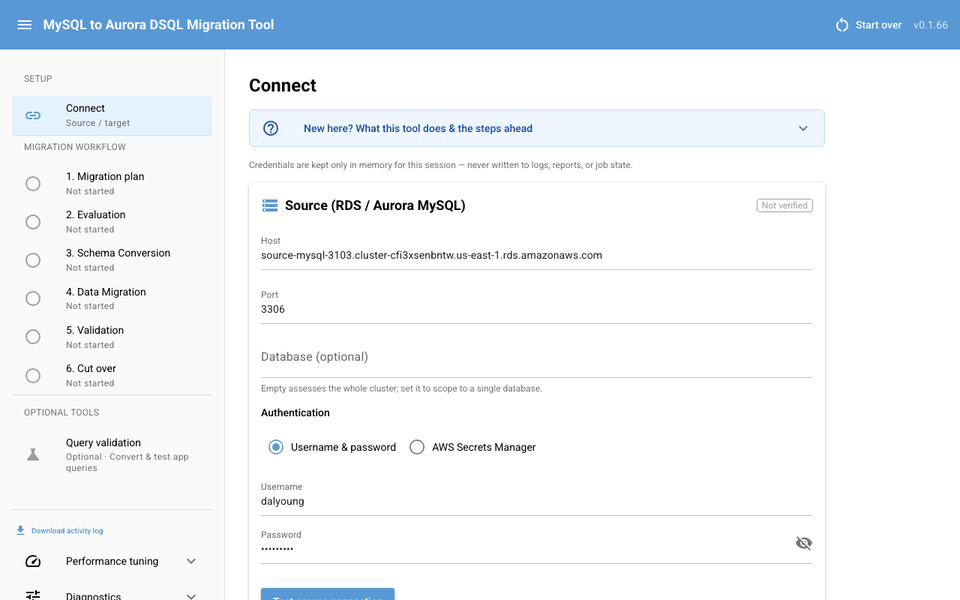
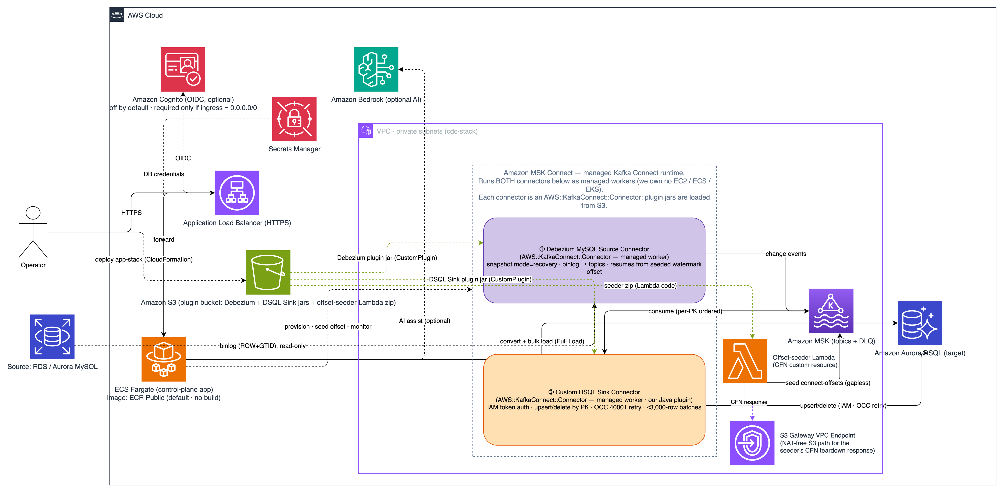

# mysql-dsql-migration-tool-with-AI

_言語: [English](README.md) | [한국어](README.ko.md) | **日本語**_

Amazon RDS MySQL / Aurora MySQL を **Amazon Aurora DSQL** へ移行する Web ベースの
オールインワンツールで、判断が必要な部分向けの **オプションの AI 支援（Amazon Bedrock）**
を内蔵しています。

Aurora DSQL は MySQL ではなく PostgreSQL 16 互換の*分散*データベースであるため、これは
2 つの変換が重なり合う **異種間移行（heterogeneous migration）** です。すなわち、MySQL →
PostgreSQL 方言、続いて PostgreSQL → DSQL の制約（外部キー非対応、楽観的並行性制御、
トランザクションごとの行数/時間制限、非同期インデックス、`C` コレーションなど）。

本ツールの目標は、完全に自動化されたゼロダウンタイム移行ではありません。目指すのは、
**移行可能性を評価し、確定的に変換できるもの（`sqlglot`）は自動化し、人手が必要な箇所を
明確に浮き彫りにすること**です。ソースデータベースへのアクセスは常に読み取り専用です。

> **ここから始めてください:** [**カスタマー FAQ**](docs/manual/ja/11-customer-faq.md)
> （計画すべき事項 — Full Load vs CDC、DSQL の制限、検証、カットオーバー、コスト）を先に読み、
> [**ユーザーマニュアル**](docs/manual/ja/README.md) の手順に従ってください。

---

## 概要

2 つのデータ経路が Aurora DSQL に収束します。ツールが駆動する 1 回限りの **Full Load** と、
マネージド MSK Connect 上で動作する任意の継続的な **CDC** ストリームです。binlog/GTID
ウォーターマークが両者をギャップなくつなぎます。

<p align="center">
  <b>Simple architecture</b><br>
  
</p>

---

## できること / できないこと

**✅ できること**

- **評価** — MySQL スキーマをイントロスペクトし、すべてのオブジェクトを分類
  （`AUTO` / `MANUAL` / `UNSUPPORTED`）。工数見積もりと名前の競合チェックを含みます。
- **スキーマ変換** — MySQL → DSQL の DDL を変換・適用（型マッピング、FK 削除、非同期
  インデックス、PK 戦略）。オブジェクトツリーからレビューして適用します。
- **Full Load** — 一貫性のあるスナップショットをストリーミングで一括ロード。再開可能、大規模対応。
- **CDC**（任意）— ニアゼロダウンタイムのカットオーバーのための継続的な変更レプリケーション。
- **Validation** — 行数・チェックサム・PK 突き合わせでソース ↔ ターゲットの一致を証明し、ドリフトを報告。
- **AI アシスト**（任意、既定はオフ）— 難しい項目への変換の提案（レビュー後にのみ適用）。

**❌ できないこと / 対象外**

- **完全自動・ゼロダウンタイムではありません** — 難しい変換と最終的な **Cut over** はご自身で判断・実行。
- **ソースには決して書き込みません** — 読み取り専用、ロールバックのアンカーとして保持。
- **CDC は DDL をレプリケートしません** — スキーマ変更は Schema Conversion を通じて。
- **クロスリージョン非対応** — ソースとターゲットは同一リージョンである必要があります。
- **DSQL が省いている機能は制約のまま** — 外部キー・トリガー・ストアドプロシージャ非対応、
  トランザクションごとの行数制限、1 値あたり 1 MiB の制限など。

> 適用される制限とその回避策の完全な一覧は、ユーザーマニュアル
> [第 6 章 — 制限事項](docs/manual/ja/06-limitations.md)。

---

## ワークフロー

Web UI は、**Connect** を予備ステップとして 6 ステップを案内します。

`Connect → Migration plan → Evaluation → Schema Conversion → Data Migration → Validation → Cut over`

| ステップ | 内容 |
| --- | --- |
| Connect | ソース（RDS/Aurora MySQL）とターゲット（Aurora DSQL）の接続情報を入力。認証情報はセッションごとのメモリに保持され、セッション終了時に破棄。 |
| 1. Migration plan | **この移行で CDC を使うか** だけを決めます。この選択はストリーミングインフラを早期にプロビジョニングするかどうかのみを左右し、取り消し可能です（Full-Load のみで開始して後から CDC を追加可能）。 |
| 2. Evaluation | ソース **と** ターゲットをイントロスペクトし、互換性レポート（`AUTO`/`MANUAL`/`UNSUPPORTED`）を生成。工数見積もり・名前の競合検出・任意の AI 戦略を含む。 |
| 3. Schema Conversion | オブジェクトを閲覧し、ソースと変換後の DDL を並べて表示、ターゲットに適用（SKIP / REPLACE）。冪等リトライを含む。 |
| 4. Data Migration | 前提条件チェックとテーブル選択の後、**Full Load**（ウォーターマーク → エクスポート → ロード、テーブルごとの進捗 + エラーログ）。任意で **CDC**（別途の cdc-stack）へ拡張。 |
| 5. Validation | ウォーターマーク時点のソースとターゲットを比較 — 行数/チェックサムの結果とドリフトを報告し、レポートをエクスポート。 |
| 6. Cut over | Validation 通過後にアプリを MySQL → DSQL へ切り替える運用ランブック — ツールが代わりに実行しない唯一のステップ。MySQL ソースはロールバックのアンカーとして保持。 |

各ステップは状態（未開始 / 進行中 / 完了 / 失敗）を表示し、独立して実行/再実行できます。
機能単位の詳細は [ユーザーマニュアル](docs/manual/ja/README.md) にあります。

---

## クイックスタート

同じツール・同じ UI で、変わるのは **どこで実行するか** だけです。評価/小規模には
**ローカル**、実運用の移行には **ECS Fargate** を推奨します。

| | **ローカル** | **ECS Fargate** |
|---|---|---|
| 適した用途 | 評価、小規模な移行 | 実運用・大規模な移行 |
| セットアップ | `uv sync` + 実行（数秒） | CloudFormation app-stack をデプロイ |
| 移行エンジンの実行場所 | ご自身のマシン | VPC 内の単一タスク Fargate サービス |
| ソース・DSQL への到達 | マシンから（プライベートなソースは VPN / SSM） | AWS 内でプライベートに（ソース → Fargate → DSQL） |
| データ経路 | マシンを経由 | AWS 内にとどまる。ブラウザは UI を開くだけ |
| プライベートなソース | トンネリングが必要 | ネイティブ対応（VPC 内） |
| コンピュート・コスト | ご自身のノート PC、無料 | Fargate タスク（ティアダウンまで課金） |

### ローカル（最速）

ご自身のマシンが移行エンジンになるため、ソース MySQL と DSQL の **両方** に到達できる必要が
あります（プライベートなソースには VPN / SSM フォワード）。AWS 認証情報は実行するシェルで
使用可能でありさえすればよいです（`aws sso login`、`AWS_PROFILE=…`）。

```bash
git clone <repo-url> mysql-dsql-migrator
cd mysql-dsql-migrator
uv sync                       # .venv 仮想環境を作成・充填（uv が必要）
cp .env.example .env          # 任意: 接続情報を事前入力（git-ignore される）
uv run mysql-dsql-migrator ui
```

既定では `http://127.0.0.1:8080` にバインドされます。表示された URL を開き、**Connect**
ステップから始めてください。

### ECS Fargate（実運用の移行）

CloudFormation で app-stack をデプロイすると（イメージのビルドなし — 公開されている ECR
Public イメージを使用）、ツールが **VPC 内** の単一タスクの Fargate サービスとして立ち上がり、
出力される ALB URL で UI に到達できます。ここでは **すべての移行トラフィックが AWS 内で行われ**
（ソース → Fargate → DSQL）、ブラウザは UI を開くだけなので、大規模な移行やプライベートな
ソースに適しています。

**完全な手順: [`deploy/DEPLOYMENT.ja.md`](deploy/DEPLOYMENT.ja.md)**（クイックデプロイ、
パラメータ、Dev/Test vs Prod、DNS と Cognito、ティアダウン、トラブルシューティング）。

<p align="center">
  <b>Console (UI)</b><br>
  
</p>

---

## アーキテクチャ

本ツールは、オペレーターが顧客環境内で実行する **Python アプリ**（NiceGUI UI + インポート
可能なエンジン）であり、評価 → 変換 → 一貫性スナップショットの一括ロード → 検証を実行します。
デプロイ時には **HTTPS ALB**（既定は `internal`、任意で Cognito）の背後の **単一タスクの
Amazon ECS Fargate サービス** として動作し、**Amazon ECR** からイメージを取得します。

[](deploy/architecture-aws.png)

> 図をクリックすると原寸解像度で開きます。

- **AI アシストはコントロールプレーンのみ** — 有効化すると Amazon Bedrock が変換の提案・CDC
  準備状況の評価・DLQ トリアージを追加しますが、Full Load / CDC の行データを見ることも触れる
  こともなく、スキーマ/DDL/プランのメタデータのみを使用します。既定はオフ、サードパーティ API
  キー不要（スコープ制限された `bedrock:InvokeModel`）。
- **CDC は任意の別経路**（`cdc-stack`）— Amazon MSK + Debezium → マネージド MSK Connect 上の
  **カスタム Aurora DSQL シンクコネクタ**（[`connectors/dsql-sink/`](connectors/dsql-sink)）。
  既製の JDBC シンクでは DSQL の短命な IAM トークン、ステートメントレベルの OCC リトライ、
  ≤3,000 行のバッチに対応できないため、当社が独自に構築しました。ツールはコントロールプレーンに
  とどまり、自前のシンクコンピューティングは一切動かしません。

> 詳しくは: [CDC と DSQL 制約](docs/manual/ja/04-cdc-and-dsql-constraints.md) ·
> [パフォーマンスとチューニング](docs/manual/ja/07-performance-and-tuning.md)。

<details>
<summary><b>使用する AWS サービス</b>（app-stack は常時、cdc-stack は任意）</summary>

移行の **ソース**（RDS / Aurora MySQL）は顧客が所有し、両スタックの外部にあります。Debezium は
MSK Connect *上で* 動作するオープンソースソフトウェアです。

**コントロールプレーンと共有（app-stack）**

| サービス | 役割 |
| --- | --- |
| Amazon ECS (Fargate) | 単一タスクのコントロールプレーンアプリ（NiceGUI + エンジン）を実行。 |
| Amazon ECR | アプリのコンテナイメージを保管（既定では ECR Public イメージ）。 |
| Elastic Load Balancing (ALB) | アプリへ転送する HTTPS のエントリポイント（既定は `internal`）。 |
| Amazon Route 53 | アプリドメインの DNS（パブリックドメイン使用時のみ。オペレーター提供）。 |
| AWS WAF | ALB 前段の Web 保護（パブリック公開時に推奨）。 |
| Amazon Cognito | ALB での OIDC 認証ゲート（パブリックインターネット公開時に必須）。 |
| AWS Certificate Manager | ALB HTTPS リスナー用の TLS 証明書。 |
| Amazon VPC | プライベートサブネット、セキュリティグループ、NAT / VPC エンドポイント。 |
| AWS IAM | 最小権限のロールと DSQL の IAM トークン認証。 |
| AWS Secrets Manager | UI セッションクッキー署名シークレット（自動作成）。既存のソース認証情報シークレットの再利用は任意。 |
| Amazon Aurora DSQL | 移行のターゲット（PostgreSQL 互換、IAM 認証、OCC）。 |
| Amazon S3 | Full Load のステージング、コネクタプラグインのアーティファクト、CodeBuild のソース。 |
| Amazon CloudWatch (Logs) | アプリとコネクタのログ。CDC のラグ / メトリクス。 |
| Amazon Bedrock | 任意の AI アシスト（コントロールプレーンのみ）。 |
| AWS CloudFormation | 両スタックの Infrastructure-as-Code。 |

通常のデプロイは ECR Public イメージをそのまま使用するため、ビルドはありません。**AWS CodeBuild**
はランタイムコンポーネントではなく、ローカルの Docker がない制限されたネットワークで自前の
イメージをビルドする必要がある場合にのみ一度だけ使う任意のビルドツール（`deploy/codebuild.yaml`）です。

**任意の CDC データプレーン（cdc-stack）**

| サービス | 役割 |
| --- | --- |
| Amazon MSK (Serverless) | Kafka のバックボーン。PK でパーティション分割されたテーブルごとのトピックと、DLQ トピック。 |
| Amazon MSK Connect | Debezium ソースと当社のカスタム DSQL シンクコネクタをホストするマネージド Kafka Connect（JSON コンバータ、`schemas.enable=true` — スキーマレジストリ不要）。 |
| AWS Lambda | VPC 内のオフセットシーダー（CFN カスタムリソース）— ギャップのない引き継ぎのために Debezium の GTID ウォーターマークを自動投入。 |
| Amazon VPC (専用) | CDC は独自の VPC で動作し、ソース MySQL へプライベートに到達。 |

</details>

---

## 前提条件

- スキーマとデータを読み取れるユーザーを持つソース **RDS / Aurora MySQL**。
- ソースと **同一リージョン** のターゲット **Aurora DSQL** クラスター（IAM トークン認証、パスワードなし）。
- 標準的なチェーン（環境 / `~/.aws` / プロファイル）で到達可能で `dsql:DbConnect` 権限を持つ
  **AWS 認証情報**。任意で `secretsmanager:GetSecretValue`、`bedrock:InvokeModel`。
- **ローカル実行時のみ:** Python 3.10 以降（3.12 に固定）、[`uv`](https://docs.astral.sh/uv/)。

> ソース DB・CDC のセットアップ（binlog など）を含む完全なチェックリスト:
> [ユーザーマニュアル §1.1](docs/manual/ja/01-setup.md)。

---

## 設定（上級者向け — 通常は触る必要なし）

すべては UI で行われ、妥当な既定値が適用されます。以下は自動化・チューニング用のオペレーター
向けリファレンスで、環境変数から読み取られ（config ファイルなし、認証情報は永続化されない）、
Fargate では ECS タスク定義に設定します。Full Load / Validation の並列度 4 つは、サイドバーの
**Performance tuning** コントロールから **実行時に** 再調整することもできます（再デプロイ不要、
再起動でリセット）。

| 変数 | 既定値 | 説明 |
| --- | --- | --- |
| `DSQL_MIGRATOR_APP_HOST` | `127.0.0.1` | UI がバインドするホスト/インターフェース。 |
| `DSQL_MIGRATOR_APP_PORT` | `8080` | UI がリッスンするポート。 |
| `DSQL_MIGRATOR_AWS_REGION` | _(未設定)_ | boto3 クライアント用の AWS リージョン。 |
| `DSQL_MIGRATOR_AWS_PROFILE` | _(未設定)_ | 任意のグローバル AWS 名前付きプロファイル。未設定時は標準チェーンにフォールバック。プロファイル名（非機密）のみ保存。 |
| `DSQL_MIGRATOR_JOB_STATE_PATH` | `job_state.sqlite` | Full Load ジョブのスナップショット（状態、テーブルごとの進捗、ウォーターマーク）— 再起動後の再開用。 |
| `DSQL_MIGRATOR_ACTIVITY_LOG_PATH` | `migration_activity.log` | 構造化アクティビティログ（イベントごとに UTC タイムスタンプ付きの JSON 1 行）。UI からダウンロード可、サイズ上限・ローテーション（約 20 MB × バックアップ 4 個）。 |
| `DSQL_MIGRATOR_SESSION_STATE_PATH` | `session_state.sqlite` | セッションごとの非機密のワークベンチ状態 — 再接続したブラウザが再開。`DSQL_MIGRATOR_STORAGE_SECRET` と併用。 |
| `DSQL_MIGRATOR_STAGING_BUCKET` | _(未設定)_ | Full Load ステージング用の S3 バケット（ストリーミングのマルチパートアップロード — 大規模テーブル向けのスケーラブルな経路）。未設定時は上限付きローカル一時 CSV（開発 / 小規模）。 |
| `DSQL_MIGRATOR_FULL_LOAD_TABLE_PARALLELISM` | `4`（≤16） | 並行してロードするテーブル数。DSQL への合計接続数をクラスターのクォータ内に収める。 |
| `DSQL_MIGRATOR_FULL_LOAD_BATCH_PARALLELISM` | `8`（≤32） | テーブルあたりの処理中の `INSERT … ON CONFLICT` バッチ数。大きいほどスループット↑、OCC（40001）衝突↑。 |
| `DSQL_MIGRATOR_FULL_LOAD_BATCH_ROWS` | `2000`（≤3000） | バッチ書き込みあたりの行数。DSQL のトランザクションごとの 3000 行制限で上限。 |
| `DSQL_MIGRATOR_FULL_LOAD_PREFETCH` | `1`（オン） | 先読み prefetch キュー（リーダースレッドが bounded キューを満たす間に書き込みが進行）。オンのままに。A/B ベンチで pre-prefetch 経路を再現する場合のみ `0`。 |
| `DSQL_MIGRATOR_FULL_LOAD_READER_SHARDS` | `1`（オフ、≤8） | 大きな単一整数 PK テーブルの読み取りを K 個の並行リーダーに分割。効果があることは稀（リーダーが GIL バウンド）— マニュアル §7.2 参照。 |
| `DSQL_MIGRATOR_FULL_LOAD_SHARD_MIN_ROWS` | `1000000` | この推定行数以上のテーブルのみリーダーシャーディング対象；小さいテーブルは常に単一リーダー。 |
| `DSQL_MIGRATOR_VALIDATE_MAX_WORKERS` | `4`（≤32） | Validation で並行して比較するテーブル数。`1` = 逐次。 |
| `DSQL_MIGRATOR_LOG_LEVEL` | `INFO` | 起動時のログレベル。`DEBUG` は失敗イベントに stacktrace（コールスタックのみ）を追加。実行時に **Diagnostics** からも変更可。 |
| `DSQL_MIGRATOR_ACTIVITY_LOG_STDOUT` | `false` | アクティビティログイベントを標準出力にもミラーリング（ECS では → CloudWatch）。実行時に **Diagnostics** から切り替え可。 |
| `BEDROCK_MODEL_ID` | `us.anthropic.claude-sonnet-4-6` | AI アシスト用の Bedrock モデル / 推論プロファイル ID。 |
| `BEDROCK_REGION` | _(未設定)_ | Amazon Bedrock 呼び出し用のリージョン。 |

AI アシストは既定でオフで、UI でオンにします。UI は Bedrock の到達可能性をチェックし、実行可能な
失敗理由を報告する **Verify AI access** のプリフライトも提供します。チューニング項目の背景は
マニュアル [パフォーマンスとチューニング](docs/manual/ja/07-performance-and-tuning.md)。

> **CDC のスケーリングはここでは設定せず、推論されます。** コネクタのノブ（テーブルごとのトピック
> パーティション数、シンクの `tasks.max`、MSK Connect の MCU）は cdc-stack のデプロイ時にキャプチャ
> 対象テーブル数から導出されます。高度な環境変数による上書き（`DSQL_MIGRATOR_CDC_TOPIC_PARTITIONS` /
> `_SINK_TASKS_MAX` / `_MCU_COUNT`）はマニュアル
> [§7.2 — CDC](docs/manual/ja/07-performance-and-tuning.md) に記載されています。

---

## プロジェクト構成

| パス | 内容 |
|---|---|
| `src/dsql_migrator/core/` | インポート可能な移行エンジン（UI 依存なし）。 |
| `src/dsql_migrator/ui/` | NiceGUI Web アプリケーション — **主要インターフェース**。 |
| `src/dsql_migrator/cli/` | 自動化のためのコマンドラインエントリポイント。 |
| `connectors/dsql-sink/` | カスタム Aurora DSQL Kafka Connect **シンクコネクタ**（Java。任意の CDC プラグイン）。 |
| `deploy/` | `Dockerfile`、CloudFormation テンプレート、ビルド/ティアダウンスクリプト、図。[`deploy/DEPLOYMENT.ja.md`](deploy/DEPLOYMENT.ja.md) を参照。 |
| `docs/manual/` | ステップバイステップのユーザーマニュアル（EN / KO / JA）。 |

---

## デプロイ

本ツールは顧客の IAM コンテキストで顧客のプライベートな RDS/Aurora と DSQL に接続するため、
**顧客環境内（シングルテナント）** で動作します — 本番では `deploy/cloudformation.yaml` から
デプロイされる単一タスクの **ECS Fargate** サービス（イメージのビルドなし）。任意のストリーミング
CDC は別途の **cdc-stack** です。

**▶ 完全なステップバイステップの手順: [`deploy/DEPLOYMENT.ja.md`](deploy/DEPLOYMENT.ja.md)。**

> [!IMPORTANT]
> **単一リージョンのみサポート。** 本ツールは Aurora DSQL を提供する任意のリージョンで動作しますが、
> ソース（RDS / Aurora MySQL）とターゲット（Aurora DSQL）は **同一リージョンになければならず**
> （リージョンは DSQL エンドポイントから導出）、プロビジョニングされるすべてのインフラ — 特に
> ソースへプライベートに到達しなければならない CDC VPC — がそのリージョンにデプロイされます。
> クロスリージョンのソース/ターゲットはサポートされません。

---

## バージョン / 変更履歴

現在のバージョン: [`pyproject.toml`](pyproject.toml)。バージョンごとの変更内容:
[**CHANGELOG.ja.md**](CHANGELOG.ja.md)。

---

## ライセンス

**Apache License 2.0** の下でライセンスされています — [`LICENSE`](LICENSE) と
[`NOTICE`](NOTICE) を参照してください。`connectors/plugins/` の下に事前ビルドされたサードパーティの
コネクタアーティファクト（Debezium とそのランタイム依存関係）をバンドルしており、それらの
ライセンスは [`THIRD-PARTY-NOTICES.md`](THIRD-PARTY-NOTICES.md) に列挙されています。バンドル
されている依存関係の 1 つ、MySQL Connector/J は Universal FOSS Exception 付きの GPL-2.0 の下に
あるため、再配布する前に確認してください。
