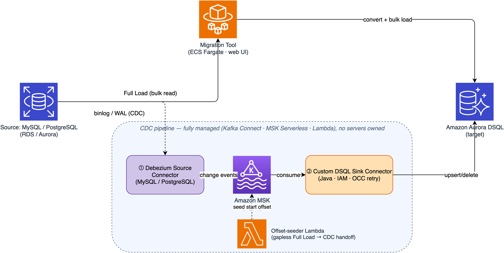
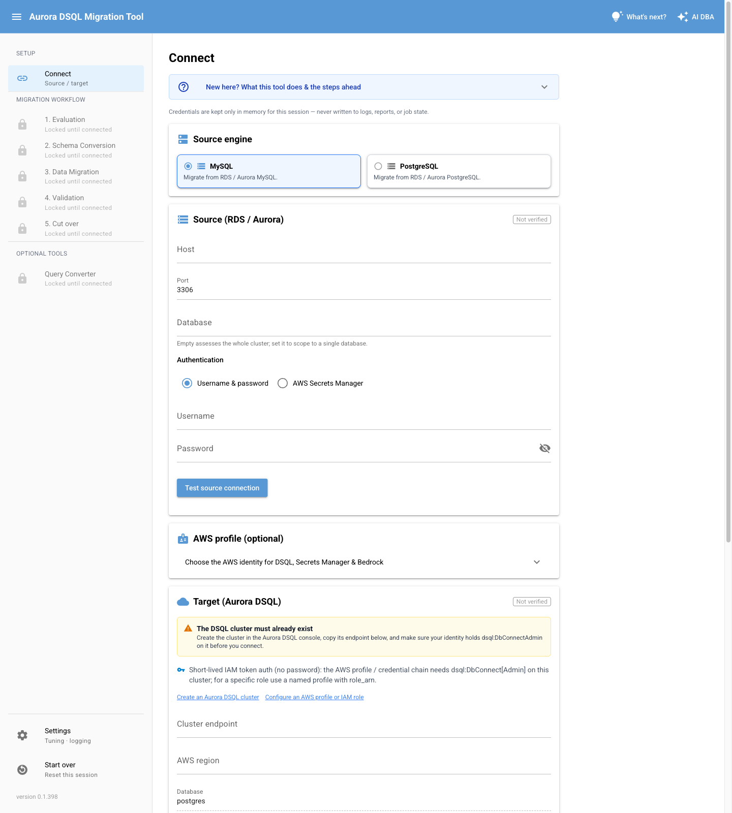
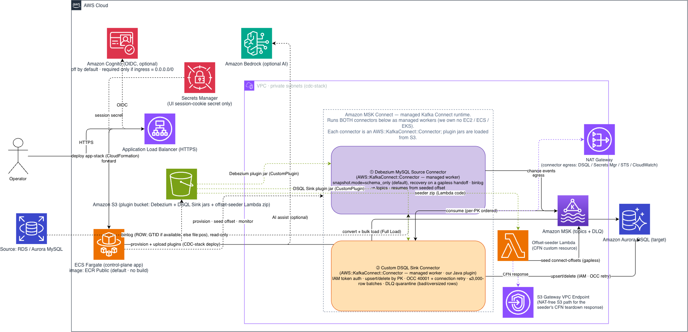

# DSQL Migration Toolkit

_言語: [English](README.md) | [한국어](README.ko.md) | **日本語**_

Amazon RDS / Aurora の **MySQL** *または* **PostgreSQL** から **Amazon Aurora DSQL**
への移行を支援する Web ベースのオールインワンツールです。人手による判断が必要な箇所
には、オプションで **AI 支援（Amazon Bedrock）** を利用できます。

Aurora DSQL は PostgreSQL 16 互換の*分散*データベースです。**MySQL** ソースは 2 段階の
変換を伴う**異種間移行（heterogeneous migration）** です。まず MySQL → PostgreSQL 方言
への変換、次に PostgreSQL → DSQL 固有の制約（外部キー非対応、楽観的同時実行制御、
トランザクションあたりの行数/時間制限、非同期インデックス、`C` コレーションなど）への
適合が必要です。**PostgreSQL** ソースは方言変換の段階を省略し（両端とも PostgreSQL）、
DSQL 固有の制約のみを適用します。

本ツールは完全自動のゼロダウンタイム移行を目指すものではありません。目標は、
**移行可能性の評価、機械的に変換できる部分（`sqlglot`）の自動化、そして人手が
必要な箇所の明確化**です。ソースデータベースへのアクセスは常に読み取り専用です。

> **最初にお読みください:** [**カスタマー FAQ**](docs/manual/ja/11-customer-faq.md)
> （計画のポイント — Full Load vs CDC、DSQL の制限、検証、カットオーバー、コスト）を
> 確認してから、[**ユーザーマニュアル**](docs/manual/ja/README.md) の手順に沿って
> 進めてください。

---

## 概要

Aurora DSQL へのデータ投入は 2 つの経路で行います。ツールが実行する 1 回限りの
**Full Load** と、マネージド MSK Connect 上で動作するオプションの **CDC**（継続的
変更レプリケーション）ストリームです。ウォーターマーク（MySQL は binlog/GTID、
PostgreSQL は LSN）により、両者はギャップなく接続されます。

<p align="center">
  <b>Simple architecture</b><br>
  
</p>

---

<br>

## できること / できないこと

**✅ できること**

- **ガイド付き Web UI** — 移行全体をブラウザアプリ 1 つで進め、各ステップの状態を可視化。
- **評価** — ソーススキーマ（MySQL または PostgreSQL）を解析し、すべてのオブジェクトを分類
  （`AUTO` / `MANUAL` / `UNSUPPORTED`）。工数見積もりと名前の競合検出を含む。
- **スキーマ変換** — ソーススキーマを DSQL DDL に変換（型マッピング、外部キー削除、非同期
  インデックス、PK 戦略）し、オブジェクトツリーでレビューしてから適用。
- **Full Load** — 一貫性のあるスナップショットをバウンデッドメモリのバッチで DSQL へ
  ストリーミング。再開可能で、大規模テーブルに対応。
- **CDC（変更データキャプチャ）** — ニアゼロダウンタイムのカットオーバーに向けてターゲットを
  最新に保つ、オプションの継続的レプリケーション。
- **Validation** — 行数・チェックサム・主キー突き合わせでソースとターゲットの一致を検証し、
  ドリフトを報告。
- **AI アシスト** — オプションで既定はオフ。マッピングが難しいオブジェクトの変換を提案し、
  レビュー後にのみ適用。
- **お好みの形態でデプロイ** — 同じツールを 3 通りで:
  **Local**  ·  **ECS Fargate**  ·  **単一 EC2 ホスト**。

**❌ できないこと / 対象外**

- **完全自動・ゼロダウンタイムではない** — 難しい変換と最終的な **Cut over** は利用者自身が
  判断・実行する。
- **ソースには一切書き込まない** — ソースは全工程で読み取り専用とし、ロールバック用のアンカーとして
  保持する。
- **CDC で DDL を複製しない** — スキーマ変更はレプリケーションストリームではなく Schema Conversion
  で対応する。
- **単一リージョンのみ** — ソースとターゲットは同一の AWS リージョンに配置する必要がある。
- **DSQL の制約をそのまま継承** — 外部キー・トリガー・ストアドプロシージャ非対応、
  トランザクションあたりの行数制限、1 値あたり ~1 MiB 制限など。

> 制限事項とその回避策の一覧は、ユーザーマニュアル
> [第 6 章 — 制限事項](docs/manual/ja/06-limitations.md) を参照。

---

<br>

## ワークフロー

Web UI は **Connect** を準備ステップとし、5 つのステップで移行を進めます。

`Connect → Evaluation → Schema Conversion → Data Migration → Validation → Cut over`

| ステップ | 内容 |
| --- | --- |
| Connect | ソース（RDS/Aurora MySQL または PostgreSQL）とターゲット（Aurora DSQL）の接続情報を入力。認証情報はセッション中のみメモリに保持し、終了時に破棄。 |
| 1. Evaluation | ソース**と**ターゲットのスキーマを解析し、互換性レポート（`AUTO`/`MANUAL`/`UNSUPPORTED`）を生成。工数見積もり・名前の競合検出・任意の AI 戦略提案を含む。 |
| 2. Schema Conversion | オブジェクト一覧を表示し、ソースと変換後の DDL を並べて比較。ターゲットへの適用（SKIP / REPLACE）を選択。冪等なリトライに対応。 |
| 3. Data Migration | 移行タイプ（**Full Load** のみ、または **CDC** 追加）を選択。前提条件チェックとテーブル選択の後にスナップショットを実行（ウォーターマーク → エクスポート → ロード、テーブルごとの進捗 + エラーログ）。CDC タイプではストリーミングインフラもここでデプロイされ、約 15〜20 分の作成が Full Load と**並行して**進む。 |
| 4. Validation | ウォーターマーク時点でソースとターゲットを比較。行数/チェックサムの結果とドリフトを報告し、レポートをエクスポート。 |
| 5. Cut over | Validation 通過後にアプリの接続先を DSQL に切り替える運用ランブック。ツールが代行しない唯一のステップ。ソース（MySQL または PostgreSQL）はロールバック用に保持。 |

各ステップは状態（未開始 / 進行中 / 完了 / 失敗）を表示し、あるステップを完了すると次が
アンロックされ、完了済みのステップは再実行できます。オプションの AI アシスタントを全ステップで
オンデマンドに利用できます。機能の詳細は [ユーザーマニュアル](docs/manual/ja/README.md) を
参照してください。

<details>
<summary><b>Console (UI)</b> — クリックで展開</summary>



</details>

---

<br>

## クイックスタート

同じツール・同じ UI で、変わるのは**実行場所**だけです。評価・小規模な移行には**ローカル**、
本番の移行には **ECS Fargate**、コンテナ/ECR や AWS Lambda を使えないアカウントは**単一 EC2
ホスト**（ソースから実行）を使います。

| | **ローカル** | **ECS Fargate** | **EC2（ソースから）** |
|---|---|---|---|
| 適した用途 | 評価、小規模な移行 | 本番・大規模な移行 | コンテナ/ECR・Lambda 不可 |
| セットアップ | `uv sync` + 実行（数秒） | CloudFormation app-stack をデプロイ | CloudFormation EC2 スタックをデプロイ（`git` + `uv`、イメージなし） |
| 移行エンジンの実行場所 | ご自身のマシン | VPC 内の単一タスク Fargate サービス | VPC 内の単一 EC2 ホスト |
| ソース・DSQL への到達 | ご自身のマシンから（プライベートなソースは VPN / SSM） | AWS 内でプライベートに（ソース → Fargate → DSQL） | AWS 内でプライベートに（ソース → EC2 → DSQL） |
| UI への接続 | ブラウザ → `127.0.0.1:8080` | ALB URL（既定は `internal`） | SSM ポートフォワード（ALB・パブリック IP なし） |
| データ経路 | ご自身のマシンを経由 | AWS 内にとどまる;ブラウザは UI を表示するだけ | AWS 内にとどまる;ブラウザは UI を表示するだけ |
| プライベートなソース | トンネリングが必要 | ネイティブ対応（VPC 内） | ネイティブ対応（VPC 内） |
| コンピュート・コスト | ご自身の PC、無料 | Fargate タスク（ティアダウンまで課金） | EC2 インスタンス + EBS（ティアダウンまで課金） |

### ローカル（最速）

ご自身のマシンが移行エンジンになるため、ソース（MySQL または PostgreSQL）と DSQL の**両方**に到達できる
必要があります（プライベートなソースには VPN / SSM フォワード）。AWS 認証情報は
シェルで利用可能であれば十分です（`aws sso login`、`AWS_PROFILE=…`）。

```bash
git clone https://github.com/awslabs/dsql-migration-toolkit.git
cd dsql-migration-toolkit
uv sync                       # .venv 仮想環境を作成（uv が必要）
cp .env.example .env          # 任意: 接続情報を事前入力（git-ignore される）
uv run mysql-dsql-migrator ui
```

既定で `http://127.0.0.1:8080` にバインドされます。表示された URL を開き、
**Connect** ステップから始めてください。

### ECS Fargate（本番の移行）

CloudFormation で app-stack をデプロイすると（イメージのビルド不要 — 公開 ECR Public
イメージを使用）、ツールが **VPC 内**の単一タスク Fargate サービスとして起動し、
出力される ALB URL で UI にアクセスできます。ここでは **移行トラフィックがすべて AWS 内で
完結**し（ソース → Fargate → DSQL）、ブラウザは UI を表示するだけなので、
大規模な移行やプライベートなソースに適しています。

**詳細な手順: [`deploy/DEPLOYMENT.ja.md`](deploy/DEPLOYMENT.ja.md)**（AWS Console・CLI、
パラメータ、カスタムドメイン・Cognito、ティアダウン、トラブルシューティング）。

### EC2 ホスト（ソースから — コンテナ・Lambda なし）

**コンテナ/ECR や AWS Lambda を使えないアカウント**向けです。同じエンジンが VPC 内の**単一 EC2
ホストでソースのまま**（`git clone` + `uv sync` + **systemd** サービス）動作します。**Fargate の
フロントドアサービスを一切立ち上げません — ECS、ALB、ACM 証明書、Cognito なし**（イメージビルドも
なし）: UI には **SSM ポートフォワード**で接続し、状態は**保持型 EBS ボリューム**にあります（S3
不要）。CDC は Kafka を**インプロセスで**シードするため、**オフセットシーダー Lambda も不要**です。
VPC 内のプライベートなデータ経路（ソース → EC2 → DSQL）は Fargate と同じで、構成要素はずっと
少なくなります。

**詳細な手順: [`deploy/DEPLOYMENT.ja.md` → 単一 EC2 ホストで実行](deploy/DEPLOYMENT.ja.md#単一-ec2-ホストで実行-ソースからlambda-free)。**

---

<br>

## 全体アーキテクチャ

本ツールは、顧客環境内で実行する **Python アプリ**（NiceGUI UI + インポート可能な
エンジン）です。評価 → 変換 → 一貫性スナップショットの一括ロード → 検証を行います。
デプロイ時は **HTTPS ALB**（既定は `internal`、オプションで Cognito 認証）の背後にある
**単一タスクの Amazon ECS Fargate サービス**として動作し、**Amazon ECR** から
イメージを取得します。コンテナや Lambda を使えないアカウントでは、代わりに**単一 EC2
ホストでソースから**（systemd + SSM ポートフォワード、ALB/ECR なし）実行できます —
[クイックスタート](#クイックスタート)を参照。

[](docs/images/architecture-aws.png)

> 図をクリックすると原寸で表示されます。

- **AI アシストはコントロールプレーンのみ** — 有効にすると Amazon Bedrock が変換案の
  提示・CDC 準備状況の評価・DLQ トリアージを行いますが、Full Load / CDC の行データには
  一切アクセスしません。スキーマ/DDL/プランのメタデータのみを使用します。既定はオフ、
  サードパーティ API キー不要（スコープ限定の `bedrock:InvokeModel`）。
- **CDC は別スタック**（`cdc-stack`）— Amazon MSK + Debezium → マネージド
  MSK Connect 上の**カスタム Aurora DSQL シンクコネクタ**
  ([`connectors/dsql-sink/`](connectors/dsql-sink))。既製の JDBC シンクでは DSQL の
  短命な IAM トークン、ステートメントレベルの OCC リトライ、≤3,000 行バッチに対応
  できないため独自に構築しました。ツールはコントロールプレーンに留まり、シンクの
  コンピューティングは持ちません。

> 詳しくは: [CDC と DSQL 制約](docs/manual/ja/04-cdc-and-dsql-constraints.md) ·
> [パフォーマンスとチューニング](docs/manual/ja/07-performance-and-tuning.md)。

<details>
<summary><b>使用する AWS サービス</b>（app-stack は常時、cdc-stack は任意）</summary>

移行の**ソース**（RDS / Aurora MySQL または PostgreSQL）は顧客所有であり、両スタックの外部です。Debezium は
MSK Connect *上で*動作するオープンソースソフトウェアです。

**コントロールプレーンと共有（app-stack）**

| サービス | 役割 |
| --- | --- |
| Amazon ECS (Fargate) | 単一タスクのコントロールプレーンアプリ（NiceGUI + エンジン）を実行。 |
| Amazon ECR | アプリのコンテナイメージを保管（既定では ECR Public イメージ）。 |
| Elastic Load Balancing (ALB) | アプリへ転送する HTTPS のエントリポイント（既定は `internal`）。 |
| Amazon Route 53 | カスタムドメイン時のみ — ALB への alias レコードを自分で作成（スタックは作成しない）。 |
| Amazon Cognito | ALB での OIDC 認証ゲート（パブリックインターネット公開時に必須）。 |
| AWS Certificate Manager | ALB HTTPS リスナー用の TLS 証明書。 |
| Amazon VPC | プライベートサブネット、セキュリティグループ、NAT / VPC エンドポイント。 |
| AWS IAM | 最小権限のロールと DSQL の IAM トークン認証。 |
| AWS Secrets Manager | UI セッションクッキー署名シークレット（自動作成）。既存のソース認証情報シークレットの再利用は任意。 |
| Amazon Aurora DSQL | 移行のターゲット（PostgreSQL 互換、IAM 認証、OCC）。 |
| Amazon S3 | Full Load のステージング、コネクタプラグインのアーティファクト、CodeBuild のソース。 |
| Amazon CloudWatch (Logs) | アプリとコネクタのログ。CDC のラグ / メトリクス。 |
| Amazon Bedrock | 任意の AI アシスト（コントロールプレーンのみ）。 |
| AWS CloudFormation | 両スタックの Infrastructure-as-Code。 |

> **注記** — 通常のデプロイは ECR Public イメージをそのまま使うため、ビルドは不要です。**AWS CodeBuild**
> はランタイムコンポーネントではなく、ローカルに Docker がない制限されたネットワークで自前
> イメージをビルドする場合にのみ一度だけ使うオプションのビルドツール（`deploy/codebuild.yaml`）です。

> **重要** — **EC2（ソースから）デプロイ**は ECS / ECR / ALB / Cognito の代わりに **Amazon EC2 + 保持型 EBS
> ボリューム + AWS Systems Manager**（Session Manager）を使い、**アプリの状態を S3 ではなくその EBS
> ボリュームに**保持します。このモードでは CDC が Kafka をインプロセスでシードするため、下記の
> **AWS Lambda** オフセットシーダーは作成されません。（CDC はコネクタアーティファクトのために上記の
> S3 プラグインバケットを引き続き自動プロビジョニングします。）[クイックスタート](#クイックスタート)を参照。

**任意の CDC データプレーン（cdc-stack）**

| サービス | 役割 |
| --- | --- |
| Amazon MSK (Serverless) | Kafka のバックボーン。PK でパーティション分割されたテーブルごとのトピックと、DLQ トピック。 |
| Amazon MSK Connect | Debezium ソースとカスタム DSQL シンクコネクタをホストするマネージド Kafka Connect（JSON コンバータ、`schemas.enable=true` — スキーマレジストリ不要）。 |
| AWS Lambda | VPC 内のオフセットシーダー（CFN カスタムリソース）— ギャップのない引き継ぎのため Debezium ウォーターマーク（MySQL GTID / PostgreSQL LSN）を自動投入。 |
| Amazon VPC | CDC は指定した VPC（通常はソースの VPC）で動作し、ソースにプライベートに到達 — 必要に応じてスタックがその中に専用サブネット + NAT を作成。 |

</details>

---

<br>

## 前提条件

- スキーマとデータの読み取り権限を持つユーザーが設定されたソース **RDS / Aurora MySQL** *または* **PostgreSQL**。
  **対応エンジン/バージョン**（エンドツーエンドで検証済み）: **RDS for MySQL** / **Aurora MySQL**
  5.7 / 8.0 / 8.4（5.7 は Extended Support 対象だがソースとして完全サポート）、および **RDS for
  PostgreSQL** / **Aurora PostgreSQL** 13–16（CDC は `pgoutput` による論理レプリケーションが必要）。
- ソースと**同一リージョン**のターゲット **Aurora DSQL** クラスター（IAM トークン認証、パスワードなし）。
- 標準チェーン（環境変数 / `~/.aws` / プロファイル）で利用可能な、`dsql:DbConnect`（`admin`
  ユーザーは `dsql:DbConnectAdmin`）権限を持つ **AWS 認証情報**。オプションで
  `secretsmanager:GetSecretValue`、`bedrock:InvokeModel`。
- **ローカル実行時のみ:** Python 3.10 以降（3.12 固定）、[`uv`](https://docs.astral.sh/uv/)。

> ソース DB・CDC のセットアップ（binlog / 論理レプリケーション など）を含む完全なチェックリストは
> [ユーザーマニュアル §1.1](docs/manual/ja/01-setup.md) を参照。

---

<br>

## プロジェクト構成

| パス | 内容 |
|---|---|
| `src/dsql_migrator/core/` | インポート可能な移行エンジン（UI 非依存）。 |
| `src/dsql_migrator/ui/` | NiceGUI Web アプリケーション — **メインインターフェース**。 |
| `src/dsql_migrator/cli/` | 自動化向けのコマンドラインエントリポイント。 |
| `connectors/dsql-sink/` | カスタム Aurora DSQL Kafka Connect **シンクコネクタ**（Java。オプションの CDC プラグイン）。 |
| `deploy/` | `Dockerfile`、CloudFormation テンプレート、ビルド/ティアダウンスクリプト、構成図。[`deploy/DEPLOYMENT.ja.md`](deploy/DEPLOYMENT.ja.md) を参照。 |
| `docs/manual/` | ステップバイステップのユーザーマニュアル（EN / KO / JA）。 |

---

<br>

## ドキュメント

| ドキュメント | 内容 |
|---|---|
| [**デプロイガイド**](deploy/DEPLOYMENT.ja.md) | ローカルはコマンド 1 つ、ECS Fargate へデプロイ（AWS コンソールまたは CLI）、または単一 EC2 ホストでソースから実行（コンテナ/Lambda なし）— 前提条件、パラメータ、カスタムドメイン / Cognito / AI アシスト、ティアダウン、トラブルシューティング。 |
| [**ユーザーマニュアル**](docs/manual/) | 5 ステップの移行手順を詳細に解説。**性能チューニングと実測結果**、テスト/検証、**お客様向け FAQ** を含む。 |
| [**全体アーキテクチャ**](#全体アーキテクチャ) | 構成要素と動作 + AWS・CDC パイプライン図（`deploy/architecture-*.png`）。 |
| [**変更履歴**](CHANGELOG.ja.md) | リリースごとの変更点（セマンティックバージョニング）。 |

多言語: [English README](README.md) · [한국어 README](README.ko.md) — デプロイガイド・
変更履歴・ユーザーマニュアルも各言語版があります。

---

<br>

## デプロイ

本ツールは顧客の IAM コンテキストで顧客のプライベートな RDS/Aurora と DSQL に接続するため、
**顧客環境内（シングルテナント）** で動作します。本番では `deploy/cloudformation.yaml` から
デプロイする単一タスクの **ECS Fargate** サービス（イメージのビルド不要）として稼働します。
コンテナ/ECR や AWS Lambda を使えないアカウントでは、代わりに**単一 EC2 ホストでソースから**
（`deploy/cloudformation-ec2.yaml`）実行できます。オプションのストリーミング CDC は別途
**cdc-stack** としてデプロイします。

**▶ 詳細な手順: [`deploy/DEPLOYMENT.ja.md`](deploy/DEPLOYMENT.ja.md)**

> [!IMPORTANT]
> **単一リージョンのみサポート。** 本ツールは Aurora DSQL が利用可能な任意のリージョンで
> 動作しますが、ソース（RDS / Aurora MySQL または PostgreSQL）とターゲット（Aurora DSQL）は**同一リージョン**
> に配置する必要があります（リージョンは DSQL エンドポイントから導出）。プロビジョニングされる
> すべてのインフラ — 特にソースへプライベートに到達する CDC VPC — もそのリージョンに
> デプロイされます。クロスリージョン構成はサポートされません。

---

<br>

## 設定（上級者向け — 通常は変更不要）

すべての操作は UI で行え、妥当な既定値が設定済みです — **ほとんどの利用者は変更不要です。**
自動化やチューニング用の環境変数リファレンスは以下を参照してください。

<details>
<summary><b>環境変数リファレンス</b> — クリックで展開</summary>

環境変数で設定します（config ファイルなし、認証情報は永続化されない）。Fargate では ECS
タスク定義で指定します。Full Load / Validation の並列度パラメータ 4 つは、サイドバーの
**Settings**（Full Load・Validation タブ）から**実行時に**調整することも可能です（再デプロイ
不要、再起動でリセット）。

| 変数 | 既定値 | 説明 |
| --- | --- | --- |
| `DSQL_MIGRATOR_APP_HOST` | `127.0.0.1` | UI がバインドするホスト/インターフェース。 |
| `DSQL_MIGRATOR_APP_PORT` | `8080` | UI がリッスンするポート。 |
| `DSQL_MIGRATOR_AWS_REGION` | _(未設定)_ | boto3 クライアント用の AWS リージョン。 |
| `DSQL_MIGRATOR_AWS_PROFILE` | _(未設定)_ | 任意のグローバル AWS 名前付きプロファイル。未設定時は標準チェーンにフォールバック。プロファイル名（非機密）のみ保存。 |
| `DSQL_MIGRATOR_JOB_STATE_PATH` | `job_state.sqlite` | Full Load ジョブのスナップショット（状態、テーブルごとの進捗、ウォーターマーク）— 再起動後の再開用。 |
| `DSQL_MIGRATOR_ACTIVITY_LOG_PATH` | `migration_activity.log` | 構造化アクティビティログ（イベントごとに UTC タイムスタンプ付きの JSON 1 行）。UI からダウンロード可、サイズ上限・ローテーション（約 20 MB × バックアップ 4 個）。 |
| `DSQL_MIGRATOR_SESSION_STATE_PATH` | `session_state.sqlite` | セッションごとの非機密のワークベンチ状態 — 再接続したブラウザが再開。`DSQL_MIGRATOR_STORAGE_SECRET` と併用。ローカルディスク — Fargate デプロイは下記の durable な S3 ストアを使用。 |
| `DSQL_MIGRATOR_SESSION_STATE_BUCKET` | _(未設定)_ | セッションスナップショット用の durable な S3 ストア — プロセス内再起動だけでなく Fargate のタスク置換（再デプロイ）を越えて再開が保持される。Fargate デプロイが管理対象プラグインバケットに自動設定（設定不要）;ローカルは未設定で上記 SQLite パスを使用。 |
| `DSQL_MIGRATOR_STAGING_BUCKET` | _(未設定)_ | Full Load ステージング用の S3 バケット（ストリーミングのマルチパートアップロード — 大規模テーブル向けのスケーラブルな経路）。未設定時は上限付きローカル一時 CSV（開発 / 小規模）。 |
| `DSQL_MIGRATOR_FULL_LOAD_TABLE_PARALLELISM` | `4`（≤16） | 並行してロードするテーブル数。DSQL への合計接続数をクラスターのクォータ内に収める。 |
| `DSQL_MIGRATOR_FULL_LOAD_BATCH_PARALLELISM` | `8`（≤32） | テーブルあたりの処理中の `INSERT … ON CONFLICT` バッチ数。大きいほどスループット↑、OCC（40001）衝突↑。 |
| `DSQL_MIGRATOR_FULL_LOAD_BATCH_ROWS` | `2000`（≤3000） | バッチ書き込みあたりの行数。DSQL のトランザクションごとの 3000 行制限で上限。 |
| `DSQL_MIGRATOR_FULL_LOAD_PREFETCH` | `1`（オン） | 先読み prefetch キュー（リーダースレッドが bounded キューを満たす間に書き込みが進行）。オンのままに。A/B ベンチで pre-prefetch 経路を再現する場合のみ `0`。 |
| `DSQL_MIGRATOR_FULL_LOAD_READER_SHARDS` | `1`（オフ、≤8） | 大きな単一整数 PK テーブルの読み取りを K 個の並行リーダーに分割。効果があることは稀（リーダーが GIL バウンド）— マニュアル §7.2 参照。 |
| `DSQL_MIGRATOR_FULL_LOAD_SHARD_MIN_ROWS` | `1000000` | この推定行数以上のテーブルのみリーダーシャーディング対象；小さいテーブルは常に単一リーダー。 |
| `DSQL_MIGRATOR_VALIDATE_MAX_WORKERS` | `4`（≤32） | Validation で並行して比較するテーブル数。`1` = 逐次。 |
| `DSQL_MIGRATOR_LOG_LEVEL` | `INFO` | 起動時のログレベル。`DEBUG` は失敗イベントに stacktrace（コールスタックのみ）を追加。実行時に **Diagnostics** からも変更可。 |
| `DSQL_MIGRATOR_ACTIVITY_LOG_STDOUT` | `false` | アクティビティログイベントを標準出力にもミラーリング（ECS では → CloudWatch）。実行時に **Diagnostics** から切り替え可。 |
| `BEDROCK_MODEL_ID` | `global.anthropic.claude-sonnet-5` | AI アシスト用の Bedrock モデル / 推論プロファイル ID。常に `global.*` プロファイル — 全ての商用リージョンから呼び出せます（`us.*` は us-east-1/us-east-2/us-west-2 でのみ解決）。 |
| `BEDROCK_REGION` | _(未設定)_ | Amazon Bedrock 呼び出し用のリージョン。 |

AI アシストは既定でオフです。UI からオンにできます。UI には Bedrock への到達性を確認し、
失敗時に原因を表示する **Verify AI access** プリフライトチェックもあります。
チューニングの詳細はマニュアル
[パフォーマンスとチューニング](docs/manual/ja/07-performance-and-tuning.md) を参照。

> **注記** — CDC のスケーリングはここでは設定しません（自動で決定されます）。コネクタの各種パラメータ
> （テーブルごとのトピックパーティション数、シンクの `tasks.max`、MSK Connect の MCU）は
> cdc-stack デプロイ時にキャプチャ対象テーブル数から自動導出されます。高度な上書き
> （`DSQL_MIGRATOR_CDC_TOPIC_PARTITIONS` / `_SINK_TASKS_MAX` / `_MCU_COUNT`）については
> マニュアル [§7.2 — CDC](docs/manual/ja/07-performance-and-tuning.md) を参照してください。

</details>

---

<br>

## バージョン / 変更履歴

現在のバージョン: [`pyproject.toml`](pyproject.toml)。リリースごとの変更点:
[**CHANGELOG.ja.md**](CHANGELOG.ja.md)。

---

<br>

## ライセンス

**Apache License 2.0** でライセンスされています — [`LICENSE`](LICENSE) と
[`NOTICE`](NOTICE) を参照してください。`connectors/plugins/` にはビルド済みの
サードパーティ製コネクタアーティファクト（Debezium とそのランタイム依存関係）を
バンドルしており、それらのライセンスは
[`THIRD-PARTY-NOTICES.md`](THIRD-PARTY-NOTICES.md) に記載しています。バンドル
されている依存関係の 1 つである MySQL Connector/J は Universal FOSS Exception 付きの
GPL-2.0 です。再配布する際はご確認ください。
