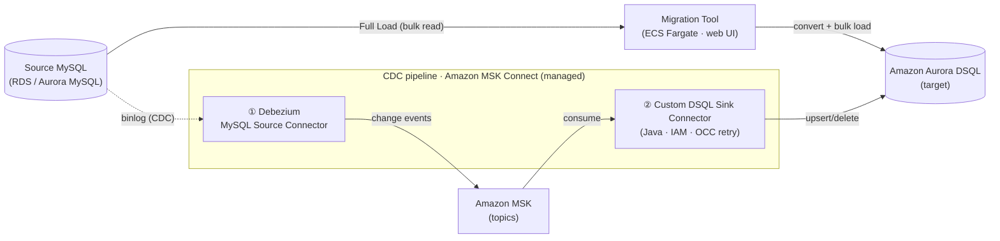

# mysql-dsql-migrator

_언어: [English](README.md) | **한국어**_

Amazon RDS MySQL / Aurora MySQL 데이터베이스를 **Amazon Aurora DSQL**로
마이그레이션하는 웹 기반 All-In-One 도구입니다.

Aurora DSQL은 MySQL이 아니라 PostgreSQL 16 호환 분산 데이터베이스이므로, 이것은
두 개의 변환이 겹치는 **이종(heterogeneous) 마이그레이션**입니다:

1. MySQL → PostgreSQL 방언
2. PostgreSQL → DSQL 제약(외래 키 없음, 낙관적 동시성 제어, 트랜잭션당 행/시간 한도,
   비동기 인덱스, `C` collation 등)

목표는 완전 자동화된 무중단 마이그레이션이 아닙니다. **마이그레이션 가능성을 평가하고,
결정론적으로 변환 가능한 것은 자동화하며, 사람의 작업이 필요한 지점을 명확히 드러내는 것**입니다.
변환은 먼저 규칙 기반 도구(`sqlglot`)로 처리하며, 소스 데이터베이스는 절대 수정하지 않고
항상 읽기 전용으로만 접근합니다.

> **시작하기 전에 [고객 FAQ](docs/manual/ko/10-customer-faq.md)를 꼭 읽어 보세요.**
> MySQL → Aurora DSQL 이기종 마이그레이션은 단순 버전 업그레이드보다 고려할 점이 많습니다 — FAQ는
> 미리 알아 두어야 할 것들을 정리해 줍니다: Full Load와 CDC 중 무엇을 쓸지, 스키마가 맞춰야 하는 DSQL
> 제약, 타입 매핑, 정확성 검증 방식, 컷오버/롤백, 그리고 비용·운영 고려사항까지. 먼저 읽어 두면
> 나중에 겪을 시행착오를 줄일 수 있습니다.
>
> **처음이신가요?** [**사용자 매뉴얼**](docs/manual/ko/README.md)은 Aurora MySQL에서 넘어오는
> 엔지니어를 위한 작업 중심 안내서입니다 — 설정, Evaluation, Schema Conversion, Full Load,
> CDC + DSQL 제약, Validation, Cut over, 그리고 한계까지.

## 한눈에 보기

두 개의 데이터 경로가 Aurora DSQL로 수렴합니다: 도구가 주도하는 일회성 **Full Load**와,
관리형 MSK Connect에서 돌아가는 선택적 연속 **CDC** 스트림.



> 편집 가능한 AWS 아이콘 소스:
> [`deploy/architecture-aws-simple.drawio`](deploy/architecture-aws-simple.drawio)
> (draw.io로 열기). 상세 토폴로지는 [아키텍처](#아키텍처)에 있습니다.

## 할 수 있는 것 / 없는 것

이 도구가 무엇을 대신 해 주고, 무엇은 직접 해야 하며, 무엇은 범위 밖인지 — 한눈에.

**✅ 할 수 있는 것**

- MySQL 스키마를 introspect해 **DSQL 호환성 평가**(`AUTO` / `MANUAL` / `UNSUPPORTED` + 작업량 추정).
- MySQL → DSQL **스키마(DDL) 자동 변환·적용** — 타입 매핑, FK 제거, 비동기 인덱스, PK 전략 등.
- **Full Load** — 일관성 스냅샷을 스트리밍으로 벌크 적재(재개 가능, TB 규모 대응).
- **CDC**(선택) — 거의 무중단 전환을 위한 연속 변경 복제(Full Load와 무손실 핸드오프).
- **Validation** — 행 수·체크섬·PK 대조로 소스↔타깃 일치 검증, 드리프트 보고.
- **AI 보조**(선택, 기본 off) — 어려운 항목의 변환 제안(검토·승인 후에만 적용).

**❌ 하지 않는 것 / 범위 밖**

- **완전 자동 무중단 마이그레이션이 아닙니다** — 어려운 변환과 최종 **Cut over**(전환)는 사람이 결정·수행.
- **소스에 절대 쓰지 않습니다** — 소스는 항상 읽기 전용(롤백 앵커로 유지).
- **DDL은 CDC로 복제되지 않습니다** — 스키마 변경은 Schema Conversion으로 직접 적용해야 함.
- **크로스 리전 불가** — 소스와 타깃이 동일 리전에 있어야 합니다.
- **DSQL이 제외한 기능은 그대로 제약** — 외래 키·트리거·저장 프로시저 없음, 트랜잭션당 행 한도,
  값당 1 MiB 한도 등(도구가 우회/대안을 안내하지만 DSQL 자체 한계는 바꿀 수 없음).

> 강제되는 한계의 전체 목록과 우회법은 사용자 매뉴얼 [6장 — 한계](docs/manual/ko/06-limitations.md)에 있습니다.

## 워크플로

웹 UI는 **Connect**를 사전 단계로 한 6단계 워크플로를 안내합니다:

`Connect → Migration plan → Evaluation → Schema Conversion → Data Migration → Validation → Cut over`

| 단계 | 하는 일 |
| --- | --- |
| Connect | 소스(RDS/Aurora MySQL)와 타깃(Aurora DSQL) 연결 정보를 입력. 자격증명은 세션별 메모리에만 있다가 세션이 끝나면 폐기됩니다. |
| 1. Migration plan | 마이그레이션 패턴(Full load only / CDC only / Full load + CDC)을 미리 선택 — 이것이 사전 점검 항목과 스트리밍(CDC) 인프라 프로비저닝 여부를 결정합니다. |
| 2. Evaluation | 소스 **와** 타깃을 introspect해 호환성 평가 리포트(`AUTO` / `MANUAL` / `UNSUPPORTED`)를 생성. 변환 작업량 추정, 타깃 이름 충돌 감지, 선택적 AI 보조 전략 포함. |
| 3. Schema Conversion | 소스/타깃 객체를 탐색하고, 소스 vs 변환 DDL을 나란히 비교하며, 변환된 DDL을 타깃에 적용(SKIP / REPLACE). |
| 4. Data Migration | 사전 점검을 실행하고 테이블을 선택한 뒤 **Full Load**: 일관성 워터마크를 캡처하고 스냅샷을 export해 타깃에 로드(테이블별 진행률 + 다운로드 가능한 에러 로그). 선택적으로 스트리밍 **CDC**(별도 cdc-stack)로 확장. |
| 5. Validation | 워터마크 시점 기준으로 마이그레이션된 타깃을 소스와 비교 — 행 수/체크섬 결과와 스냅샷 이후 드리프트를 보고하고 리포트를 export. |
| 6. Cut over | Validation을 통과한 뒤 애플리케이션을 MySQL에서 DSQL로 전환하는 운영 런북 — 도구가 대신 실행해 주지 않는 유일한 단계. 패턴별로 맞춤(CDC drain vs Full Load freeze)이며, MySQL 소스를 롤백 앵커로 유지합니다. |

각 단계는 상태(시작 안 함 / 진행 중 / 완료 / 실패)를 표시하며 독립적으로 실행/재실행할 수 있고,
사전 단계가 미완료면 UI가 안내합니다.

## 기능

- 테이블, 컬럼, 타입, 기본 키, 인덱스, 외래 키, 뷰, 트리거, 루틴, `AUTO_INCREMENT`,
  charset/collation에 대한 **읽기 전용 소스 introspection**.
- 모든 객체를 분류하고 DSQL 제약(FK, 트리거, 절차적 루틴, PK 없음, 대소문자 무시 collation,
  파티셔닝, 미지원 타입)을 이유·권장과 함께 플래그하는 **호환성 평가**.
- `sqlglot` 기반 **스키마(DDL) 변환**: 타입 매핑, 앱 계층 무결성 주석과 함께 FK 제거,
  `CREATE INDEX ASYNC`, PK 전략, 트랜잭션당 단일 DDL 단위로 분할된 DDL/DML.
- **대화형 적용**(AWS Schema Conversion Tool과 유사): 객체 트리, DDL 차이, 충돌 처리, 적용 시 `40001`/OC001 안전 재시도(다시 시도해도 중복 부작용 없음).
- 락 안티패턴 감지(예: DSQL 제약에 대한 `SELECT ... FOR UPDATE`)를 포함한 **쿼리(DML) 변환**.
- 워터마크 캡처(binlog 좌표 / GTID / 스냅샷 타임스탬프), 일관성 스냅샷 export, OCC 재시도를 동반한
  배치 `INSERT ... ON CONFLICT` import(Aurora DSQL Loader가 주 경로), 트랜잭션당 한도를 존중하는
  재개 가능·청크 설계의 **데이터 마이그레이션**.
- 행 수와 샘플링·체크섬으로 소스와 타깃을 대조하는 **검증(Validation)**. 운영 중인 소스는
  워터마크를 기준으로 마이그레이션 이후 바뀐 데이터(드리프트)까지 보고합니다.
- `FOR UPDATE`, FK 의존, `AUTO_INCREMENT` 의존, 트리거/SP 호출, 미지원 함수처럼 DSQL에서
  문제가 되는 **애플리케이션 안티패턴을 자동으로 찾아내 알려주는 검사 기능**.
- **선택적 AI 보조 변환**(Amazon Bedrock): 기본 비활성. 켜면 `MANUAL`/`UNSUPPORTED` 항목에 대한
  검토 전용 제안을 생성합니다. 제안은 명시적 사람 검토·승인 없이는 절대 적용되지 않습니다.
- **선택적 대규모 스트리밍 CDC**(별도 `cdc-stack`): 관리형 MSK Connect 위의 Debezium →
  Amazon MSK → **커스텀 Aurora DSQL 싱크 커넥터**(커스텀 Java 플러그인). 통합 모니터링과 단일
  다운로드 가능한 에러 로그 제공. 이 도구는 파이프라인을 설정·관리(Control Plane)만 하고, 실제
  싱크 작업은 관리형 MSK Connect에서 커넥터가 수행합니다 — 도구가 직접 운영하는 Sink Server는 없습니다.

## 아키텍처

이 도구는 운영자가 고객 환경 안에서 실행하는 **Python 앱**(NiceGUI UI + import 가능한 엔진)으로,
규칙 기반 변환을 먼저 적용하는 마이그레이션(평가 → 변환 → 일관성 스냅샷 벌크 로드 → 검증)을
수행합니다. 배포 시 단일 태스크 **Amazon ECS Fargate** 서비스로 **HTTPS ALB**(기본 `internal`,
선택적 Cognito) 뒤에서 돌고, 컨테이너 이미지는 **Amazon ECR**(기본 ECR Public 이미지)에서
가져옵니다. 전체 경로 한눈 요약은 위 [한눈에 보기](#한눈에-보기)를 참고하세요.

- **AI 보조는 컨트롤 플레인만** — 켜면 **Amazon Bedrock**이 변환 제안·CDC 준비도·DLQ 분류를
  더해 주지만, **CDC 데이터 경로에는 절대 들어가지 않습니다**(기본 off).
- **CDC는 선택적 별도 경로** — 거의 무중단 전환이 필요하면 **Amazon MSK + Debezium** 스트리밍
  파이프라인(별도 `cdc-stack`)을 띄울 수 있습니다. 데이터를 실제로 DSQL에 쓰는 싱크는 관리형 MSK
  Connect 위의 **커스텀 DSQL 싱크 커넥터**([`connectors/dsql-sink/`](connectors/dsql-sink))이며,
  표준 JDBC 싱크로는 DSQL의 단기 IAM 토큰·구문 단위 OCC 재시도·≤3,000행 배치를 감당할 수 없어 직접
  만들었습니다. 이 도구는 컨트롤 플레인(설정·벌크 로드·워터마크·모니터링)만 맡고 싱크 실행 자원은
  직접 운영하지 않습니다.

> **더 알아보기:**
> - 전체 AWS 아이콘 토폴로지(편집 가능): [`deploy/architecture-aws.drawio`](deploy/architecture-aws.drawio)
>   ([draw.io](https://app.diagrams.net/)로 열기), 간소화 개요:
>   [`deploy/architecture-aws-simple.drawio`](deploy/architecture-aws-simple.drawio).
> - 사용 서비스별 역할: 아래 [사용되는 AWS 서비스](#사용되는-aws-서비스).
> - CDC·DSQL 제약의 데이터 경로 동작: 사용자 매뉴얼
>   [4장 — CDC와 DSQL 제약](docs/manual/ko/04-cdc-and-dsql-constraints.md).
> - 성능·확장(커스텀 싱크가 필요한 이유, 병렬수 튜닝): 매뉴얼
>   [7장 — 성능과 튜닝](docs/manual/ko/07-performance-and-tuning.md).

## 사용되는 AWS 서비스

컨트롤 플레인(app-stack)은 항상 사용되며, 스트리밍 CDC 데이터 플레인(cdc-stack)은 선택입니다.
마이그레이션 **소스**(Amazon RDS / Aurora MySQL)는 고객 소유이며 두 스택 모두와 무관합니다.
Debezium은 MSK Connect **위에서** 실행되는 오픈소스 소프트웨어이며 별도의 AWS 서비스가 아닙니다.

**컨트롤 플레인 & 공유 (app-stack)**

| 서비스 | 역할 |
| --- | --- |
| Amazon ECS (Fargate) | 단일 태스크 컨트롤 플레인 앱(NiceGUI + 엔진)을 실행. |
| Amazon ECR | Fargate가 가져오는 앱 컨테이너 이미지를 저장(기본은 ECR Public 이미지). |
| Elastic Load Balancing (ALB) | 앱으로 전달하는 HTTPS 진입점(기본 `internal`). |
| Amazon Route 53 | 앱 도메인 DNS(공개 도메인 사용 시, 운영자 제공). |
| AWS WAF | ALB 앞단의 웹 보호(공개 노출 시 권장). |
| Amazon Cognito | ALB의 OIDC 인증 게이트(선택 — 공용 인터넷 노출 시 필수). |
| AWS Certificate Manager (ACM) | ALB HTTPS 리스너용 TLS 인증서. |
| Amazon VPC | 프라이빗 서브넷, 보안 그룹, NAT / VPC 엔드포인트(app-stack & cdc-stack). |
| AWS IAM | 최소 권한 task / execution / connector 역할 및 DSQL IAM 토큰 인증. |
| AWS Secrets Manager | UI 세션 쿠키 서명 시크릿(스택이 자동 생성). 소스 MySQL 자격증명은 기본적으로 UI에서 입력하며, 기존 시크릿을 재사용할 때만 추가로 사용(런타임에 읽음, 템플릿에 저장 안 됨). |
| Amazon Aurora DSQL | 마이그레이션 타깃(PostgreSQL 호환, IAM 인증, OCC). |
| Amazon S3 | Full Load 스테이징(대용량 테이블 스트리밍 export), 커넥터 플러그인 아티팩트, CodeBuild 소스. |
| Amazon CloudWatch (Logs) | 앱·커넥터 로그, CDC lag / 메트릭. |
| Amazon Bedrock | 선택적 AI 보조 변환 / CDC 준비도 / DLQ 분류(컨트롤 플레인만). |
| AWS CloudFormation | app-stack과 cdc-stack의 IaC. |

> 일반 배포는 게시된 **ECR Public 이미지**를 그대로 가져오므로 이미지 빌드가 **없습니다**.
> **AWS CodeBuild**는 런타임 구성요소가 아니라, 로컬 Docker가 없는 제한된 네트워크에서 자체 이미지를
> 빌드해야 할 때만 별도 빌드 스택(`deploy/codebuild.yaml`)으로 한 번 쓰는 **선택적 빌드 도구**입니다.

**선택적 CDC 데이터 플레인 (cdc-stack)**

| 서비스 | 역할 |
| --- | --- |
| Amazon MSK (Serverless) | Kafka 백본: PK로 파티셔닝된 테이블당 토픽 + DLQ 토픽. |
| Amazon MSK Connect | Debezium MySQL 소스 커넥터와 커스텀 DSQL 싱크 커넥터를 호스팅하는 관리형 Kafka Connect 런타임. 스키마는 런타임 내장 **JSON 컨버터**(`schemas.enable=true`)로 전달 — 별도 스키마 레지스트리 불필요. |
| AWS Lambda | in-VPC **오프셋 시더** — Full Load → CDC gapless 핸드오프를 위해 Debezium 오프셋(GTID 워터마크)을 connect-offsets 토픽에 자동 시드하는 CloudFormation 커스텀 리소스. |
| Amazon VPC (전용) | CDC는 자체 VPC(프라이빗 서브넷·NAT·VPC 엔드포인트)에 배포되어 소스 MySQL에 프라이빗하게 도달. |

## 사전 요구사항

마이그레이션을 시작하기 전에 다음이 필요합니다.

**공통 (어느 실행 방식이든)**

- 소스 **Amazon RDS / Aurora MySQL** — 스키마와 데이터를 읽을 수 있는 사용자(읽기 전용으로 충분 —
  도구는 소스에 절대 쓰지 않습니다).
- 타깃 **Amazon Aurora DSQL** 클러스터 — 소스와 **동일 리전**. (비밀번호 없음 — IAM 토큰 인증.)
- **AWS 자격증명** — 표준 자격증명 체인(환경 변수, `~/.aws`, 또는 named profile)으로 도달 가능하고,
  Aurora DSQL IAM 토큰 생성(`dsql:DbConnect`) 권한 보유. 소스 자격증명을 Secrets Manager에 둘
  때는 `secretsmanager:GetSecretValue`, AI 보조를 켤 때는 `bedrock:InvokeModel`도 필요(둘 다 선택).

**로컬에서 실행할 때만 추가로**

- Python 3.10+ (프로젝트는 `.python-version`으로 3.12 고정)
- 의존성 관리를 위한 [`uv`](https://docs.astral.sh/uv/) — `curl -LsSf https://astral.sh/uv/install.sh | sh`

> 소스 DB 측 설정과 CDC 요구사항(binlog 등)을 포함한 전체 체크리스트는
> [사용자 매뉴얼 §1.1](docs/manual/ko/01-setup.md)에 있습니다.

## 빠른 시작 (clone → 실행)

### 옵션 A — 로컬 실행 (가장 빠름)

추가 인프라 없이 내 머신에서 바로 UI를 띄웁니다. 평가·소규모·개발에 적합합니다.

```bash
# 1. 저장소 clone
git clone <repo-url> mysql-dsql-migrator
cd mysql-dsql-migrator

# 2. 의존성 설치 (uv가 .venv 가상환경을 만들고 채웁니다)
uv sync

# 3. (선택) 연결 정보를 미리 채워 두기 — Connect 화면이 자동으로 불러옵니다
cp .env.example .env
#   편집기로 .env 를 열어 소스/타깃 연결 값을 채우세요. .env 는 git-ignore 됩니다.

# 4. 웹 UI 실행
uv run mysql-dsql-migrator ui
```

기본적으로 `http://127.0.0.1:8080`에 바인딩됩니다. 출력된 URL을 브라우저에서 열고 **Connect**
단계부터 시작하세요. 각 단계가 무엇을 하는지는 [**사용자 매뉴얼**](docs/manual/ko/README.md)이
처음부터 끝까지 안내합니다.

> 이때 **내 머신이 마이그레이션 엔진**입니다 — 모든 데이터가 내 머신과 네트워크를 통과하므로,
> 내 머신이 소스 MySQL과 DSQL **양쪽**에 도달할 수 있어야 합니다(프라이빗 소스는 VPN/SSM 포워딩).

### 옵션 B — ECS Fargate (실제 마이그레이션)

실제 마이그레이션에서는 같은 도구를 AWS에 배포합니다. clone 후 **CloudFormation으로 app-stack을
배포**하면(이미지 빌드 불필요 — 게시된 ECR Public 이미지 사용) 도구가 내 VPC 안의 단일 태스크
Fargate 서비스로 뜨고, 출력된 **ALB URL**로 UI에 접속합니다.

```bash
git clone <repo-url> mysql-dsql-migrator
cd mysql-dsql-migrator
# 그다음 CloudFormation 배포 — 정확한 명령·파라미터는 배포 가이드 참고
```

**전체 단계는 [`deploy/DEPLOYMENT.ko.md`](deploy/DEPLOYMENT.ko.md)에 있습니다**(아래 [배포](#배포)
요약). 로컬과 달리, **마이그레이션 트래픽(소스 읽기 → 변환 → DSQL 쓰기)은 전부 AWS 내부에서
발생하며 내 로컬 머신을 거치지 않습니다** — 내 브라우저는 ALB URL로 UI만 띄울 뿐, 데이터 경로에는
들어가지 않습니다. 그래서 대용량/TB 마이그레이션과 프라이빗 소스에 적합합니다.

> 두 방식의 상세 비교는 아래 [실행 방식: 로컬 vs ECS Fargate](#실행-방식-로컬-vs-ecs-fargate) 표를 보세요.

> AWS 자격증명은 위 명령을 실행하는 셸에서 평소처럼(예: `aws sso login`, `AWS_PROFILE=...`,
> 환경 변수) 사용 가능하면 됩니다. 도구가 그 자격증명으로 DSQL IAM 토큰을 발급합니다.

## 실행 방식: 로컬 vs ECS Fargate

같은 도구·같은 UI·같은 마이그레이션 단계지만, **어디서 실행하느냐**만 다릅니다. 평가·소규모는
로컬, 실제 마이그레이션은 Fargate를 권장합니다.

| | **로컬 (내 머신)** | **ECS Fargate (AWS 배포)** |
|---|---|---|
| 적합한 경우 | 평가, 소규모, 개발 | 실제 마이그레이션, 대용량/TB |
| 실행 위치 | 내 노트북/워크스테이션 | 고객 VPC 안의 단일 태스크 Fargate |
| **데이터 경로** | 소스→**내 머신**→DSQL (모든 데이터가 내 머신·네트워크를 통과) | 소스→**VPC 내 Fargate**→DSQL (데이터가 AWS 안에 머묾) |
| 네트워크 도달 | 내 머신이 소스 MySQL과 DSQL **양쪽**에 도달해야 함(프라이빗 소스는 VPN/SSM 포워딩) | Fargate가 VPC 안에서 소스에 프라이빗하게 도달 |
| 접속 방법 | 브라우저 → `127.0.0.1:8080` | 브라우저 → ALB(기본 `internal`, VPN/Direct Connect/SSM로 도달) |
| 인증 | 로컬이라 불필요 | 네트워크가 게이트(기본). 공개 노출 시 Cognito 필수 |
| 대용량 스테이징 | 로컬 임시 CSV(소형 전용) | S3 스테이징(대용량 스트리밍) |
| 설정 방법 | 위 [빠른 시작](#빠른-시작-clone--실행) | CloudFormation — [배포](#배포) / [`deploy/DEPLOYMENT.ko.md`](deploy/DEPLOYMENT.ko.md) |
| 인프라 | 없음 | ECS·ALB·IAM 등(CloudFormation이 프로비저닝) |

> **요지:** 로컬은 *내 머신이 마이그레이션 엔진*이라 소스·타깃 양쪽 네트워크 도달이 관건입니다.
> Fargate는 그 엔진을 VPC 안으로 옮겨 데이터 경로를 AWS 안에 두는, 호스팅된 형태입니다.

## 설정 (고급 — 보통은 건드릴 필요 없음)

> 일반 사용자는 이 섹션을 **건너뛰어도 됩니다** — 모든 작업은 UI에서 이뤄지고 합리적 기본값이
> 적용됩니다. 아래는 자동화·튜닝·문제 해결에 필요한 운영자용 환경 변수 레퍼런스입니다(성능 튜닝
> 노브의 배경은 매뉴얼 [성능과 튜닝](docs/manual/ko/07-performance-and-tuning.md) 장 참고).

설정은 환경 변수에서 읽으며, 자격증명 값은 설정에 절대 영속화되지 않습니다.

| 변수 | 기본값 | 설명 |
| --- | --- | --- |
| `DSQL_MIGRATOR_APP_HOST` | `127.0.0.1` | UI가 바인딩할 호스트/인터페이스. |
| `DSQL_MIGRATOR_APP_PORT` | `8080` | UI가 수신할 포트. |
| `DSQL_MIGRATOR_AWS_REGION` | _(미설정)_ | boto3 클라이언트(예: DSQL 토큰 생성)용 AWS 리전. |
| `DSQL_MIGRATOR_AWS_PROFILE` | _(미설정)_ | 모든 AWS 클라이언트에 적용되는 선택적 단일 글로벌 AWS named profile. 미설정 시 표준 자격증명 체인으로 폴백. 프로필 이름(비밀 아님)만 저장됩니다. |
| `DSQL_MIGRATOR_JOB_STATE_PATH` | `job_state.sqlite` | 로컬 job-state 저장소 경로. Full Load 작업 스냅샷(상태, 테이블별 진행률, 워터마크)이 여기에 영속화되고 재시작 시 다시 로드되어 중단된 작업을 재개할 수 있습니다(중단된 진행 중 테이블은 부분 재시도를 위해 실패로 표면화). |
| `DSQL_MIGRATOR_ACTIVITY_LOG_PATH` | `migration_activity.log` | 구조화된 활동 로그 파일 경로. 모든 마이그레이션 이벤트 — 연결 테스트, 평가 실행, 객체별 스키마 적용(CREATED/SKIPPED/FAILED), 테이블별 Full Load 결과(성공/실패와 상세), CDC 컨트롤 플레인 동작 — 이 UTC 타임스탬프 JSON 한 줄로 추가됩니다. UI("Download activity log")에서 다운로드해 전체 타임라인을 시간순으로 읽을 수 있고, 성공·실패 모두 기록됩니다(작업별 에러 로그는 실패 전용·행 단위 산출물로 별도 유지). 파일은 크기 제한·회전되어(세그먼트당 ~20 MB, 백업 4개, 총 ~100 MB) 무한히 커지지 않으며, 다운로드는 보존된 세그먼트를 시간순으로 이어 붙입니다. `DSQL_MIGRATOR_LOG_LEVEL=DEBUG`일 때 실패 이벤트는 전체 Python `stacktrace`(콜 스택만 — 행 값이나 자격증명은 절대 없음)를 추가로 담고, 기본 `INFO`에서는 생략됩니다. |
| `DSQL_MIGRATOR_SESSION_STATE_PATH` | `session_state.sqlite` | 로컬 세션별 상태 저장소 경로. 각 세션의 비밀이 아닌 워크벤치 상태(워크플로 진행, 평가 결과, 생성된 객체, 마이그레이션 작업 연결)를 영속화해 재연결한 브라우저가 재시작 후에도 이어서 작업합니다. 브라우저 세션 id가 재시작 간에도 안정적이도록 `DSQL_MIGRATOR_STORAGE_SECRET`과 함께 사용하세요. |
| `DSQL_MIGRATOR_STAGING_BUCKET` | _(미설정)_ | Full Load 스테이징용 선택적 S3 버킷. 설정 시 각 테이블을 스트리밍 멀티파트 업로드로 이 버킷에 export하고 `s3://` URI에서 로드하므로, 전체 테이블 CSV가 컨테이너 임시 디스크에 절대 떨어지지 않습니다(대형/TB 테이블용 확장 경로). 미설정 시 제한된 로컬 임시 CSV를 사용(로컬 개발 / 소형 테이블 전용). |
| `DSQL_MIGRATOR_FULL_LOAD_TABLE_PARALLELISM` | `4` (≤16) | Full Load: 동시에 로드하는 테이블 수. 총 동시 DSQL 연결 ≈ 테이블 × 배치 병렬수. 클러스터 연결 쿼터 안에서 유지하세요. 매뉴얼의 [성능과 튜닝](docs/manual/ko/07-performance-and-tuning.md) 장 참고. |
| `DSQL_MIGRATOR_FULL_LOAD_BATCH_PARALLELISM` | `8` (≤32) | Full Load: 테이블당 in-flight `INSERT ... ON CONFLICT` 배치 수. 높을수록 처리량↑ 그러나 핫 키 범위에서 OCC(40001) 충돌↑. |
| `DSQL_MIGRATOR_FULL_LOAD_BATCH_ROWS` | `2000` (≤3000) | Full Load: 배치 쓰기당 행 수, DSQL의 트랜잭션당 3000행 한도로 하드캡. |
| `DSQL_MIGRATOR_VALIDATE_MAX_WORKERS` | `4` (≤32) | Validation: 동시에 비교하는 테이블 수(각각 자체 읽기 전용 소스 + 타깃 연결). `1` = 순차. |
| `DSQL_MIGRATOR_LOG_LEVEL` | `INFO` | 시작 로그 레벨. `DEBUG`로 설정하면 활동 로그 실패 이벤트에 전체 Python `stacktrace`(콜 스택만 — 행 값이나 자격증명은 절대 없음)를 추가로 캡처. 이는 초기값일 뿐이며, 문제 해결 중 앱의 **Diagnostics** 컨트롤(사이드바 푸터)에서 런타임에 변경 가능(재배포 불필요). |
| `DSQL_MIGRATOR_ACTIVITY_LOG_STDOUT` | `false` | 각 활동 로그 이벤트를 (회전 파일에 더해) stdout에 JSON 한 줄로 미러링하는 시작 기본값. ECS에서는 컨테이너의 `awslogs` 드라이버가 stdout을 CloudWatch Logs로 전달해, 태스크 교체에도 살아남는 내구성 있고 쿼리 가능한 감사 추적 사본을 제공(회전 파일은 임시 스토리지에 존재). 이는 초기값일 뿐이며, 문제 해결 중 앱의 **Diagnostics** 컨트롤(사이드바 푸터)에서 런타임에 토글 가능(재배포 불필요). |
| `BEDROCK_MODEL_ID` | `us.anthropic.claude-sonnet-4-6` | AI 보조 변환(opt-in)에 사용하는 Bedrock 모델 / 추론 프로파일 id. |
| `BEDROCK_REGION` | _(미설정)_ | Amazon Bedrock 호출용 리전. |

AI 보조 변환은 기본 비활성이며 UI에서 켭니다. Connect/설정 화면은 구성된 Bedrock 모델/리전이
도달 가능한지 확인하고 자격증명을 노출하지 않으면서 조치 가능한 실패 이유(접근 거부, 모델 미활성화,
스로틀)를 보고하는 **Verify AI access** 사전 점검도 제공합니다.

## 프로젝트 구조

코드를 살펴볼 때 알아 둘 최상위 디렉터리입니다.

| 경로 | 내용 |
|---|---|
| `src/dsql_migrator/core/` | import 가능한 마이그레이션 엔진(UI 의존성 없음). |
| `src/dsql_migrator/ui/` | NiceGUI 웹 애플리케이션 — **주 인터페이스**. |
| `src/dsql_migrator/cli/` | 자동화용 명령줄 진입점. |
| `connectors/dsql-sink/` | 커스텀 Aurora DSQL Kafka Connect **싱크 커넥터**(Java; 선택적 CDC 데이터 플레인 플러그인). |
| `deploy/` | 배포 자산 — `Dockerfile`, CloudFormation 템플릿(app-stack·cdc-stack), 빌드/teardown 스크립트, 아키텍처 다이어그램. 자세한 내용은 [`deploy/DEPLOYMENT.ko.md`](deploy/DEPLOYMENT.ko.md). |
| `docs/manual/` | 단계별 사용자 매뉴얼(영·한). |

## 배포

이 도구는 고객의 프라이빗 RDS/Aurora와 DSQL에 고객의 IAM 컨텍스트로 연결하므로, 중앙 SaaS가 아니라
**고객 환경 안에서(단일 테넌트)** 실행됩니다 — 프로덕션에서는 단일 태스크 **Amazon ECS Fargate**
서비스로, 이미지 빌드 없이(게시된 ECR Public 이미지) `deploy/cloudformation.yaml`(app-stack)을
배포합니다.

**▶ 전체 단계별 절차는 [`deploy/DEPLOYMENT.ko.md`](deploy/DEPLOYMENT.ko.md)에 있습니다** — 빠른
배포, CloudFormation 파라미터, Dev/Test vs Prod 프로파일, DNS·Cognito, 검증, 업데이트, teardown,
문제 해결까지. (선택적 대규모 스트리밍 CDC는 별도의 **cdc-stack**으로, 가이드에서 다룹니다.)

> [!IMPORTANT]
> **리전 제약 — 단일 리전만; 크로스 리전 마이그레이션 미지원.** 이 도구는 **Aurora DSQL을 제공하는
> 모든 AWS 리전**에서 동작하지만, **소스(RDS / Aurora MySQL)와 타깃(Aurora DSQL)은 동일 리전에
> 있어야 하며**, 도구가 프로비저닝하는 모든 인프라가 그 한 리전에 배포됩니다(리전은 DSQL 타깃
> 엔드포인트에서 도출 — 예: `…dsql.ap-northeast-2.on.aws` → `ap-northeast-2`). 특히 선택적 CDC
> 데이터 플레인은 **DSQL 리전의 VPC 안에서** 실행되며 소스 MySQL에 프라이빗하게 도달해야 하므로,
> 크로스 리전 소스/타깃 페어링은 지원되지 않습니다.

> **문서 전체 흐름:** 이 README가 오리엔테이션(무엇인지·아키텍처) → [`deploy/DEPLOYMENT.ko.md`](deploy/DEPLOYMENT.ko.md)가
> 배포해 UI를 띄우고 → [**사용자 매뉴얼**](docs/manual/ko/README.md)이 그 UI에서 실제 마이그레이션을
> 단계별로 안내합니다. 전체 런타임 토폴로지는 위 [아키텍처](#아키텍처) 다이어그램을 참고하세요.

## 버전 / 변경 이력

현재 버전은 [`pyproject.toml`](pyproject.toml)에 명시되어 있으며, 버전별로 추가·변경된 기능은
[**변경 이력(CHANGELOG.ko.md)**](CHANGELOG.ko.md)에 정리되어 있으니, 업데이트 후 무엇이 새로
생겼는지 거기서 확인하세요.

## 라이선스

**Apache License 2.0**으로 배포됩니다 — [`LICENSE`](LICENSE)와 [`NOTICE`](NOTICE)를 참고하세요.
이 프로젝트는 `connectors/plugins/` 아래에 미리 빌드된 서드파티 커넥터 아티팩트(Debezium 및 런타임
의존성)를 번들로 포함하며, 각 라이선스는 [`THIRD-PARTY-NOTICES.md`](THIRD-PARTY-NOTICES.md)에
정리되어 있습니다. 번들된 의존성 중 MySQL Connector/J는 GPL-2.0(Universal FOSS Exception 포함)이므로
재배포 전 확인이 필요합니다.
