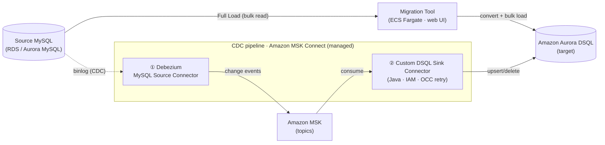

# mysql-dsql-migrator

_Language: **English** | [한국어](README.ko.md)_

A web-based all-in-one tool for migrating Amazon RDS MySQL / Aurora MySQL
databases to **Amazon Aurora DSQL**.

Aurora DSQL is a PostgreSQL 16–compatible distributed database, not a MySQL one,
so this is a **heterogeneous migration** with two overlapping conversions:

1. MySQL → PostgreSQL dialect
2. PostgreSQL → DSQL constraints (no foreign keys, optimistic concurrency
   control, per-transaction row/time limits, async indexes, `C` collation, etc.)

The goal is not fully automated zero-downtime migration. It is to **assess
migratability, automate what can be converted deterministically, and clearly
surface the points that need human work.** Conversion is deterministic-first
(`sqlglot`); the source database is always accessed read-only.

> **Before you start, read the [Customer FAQ](docs/manual/en/11-customer-faq.md).**
> A heterogeneous MySQL → Aurora DSQL migration has more moving parts than a
> version upgrade — the FAQ answers, up front, what to plan for: Full Load vs CDC,
> the DSQL limitations your schema must fit, type mapping, how correctness is
> validated, cut-over/rollback, and cost/operational considerations. Reading it
> first will save you surprises later.
>
> **New here?** The [**User Manual**](docs/manual/README.md) is a task-oriented
> walkthrough for engineers coming from Aurora MySQL — set up, Evaluation, Schema
> Conversion, Full Load, CDC + DSQL constraints, Validation, and limitations.

## At a glance

Two data paths converge on Aurora DSQL: a one-shot **Full Load** driven by the
tool, and an optional continuous **CDC** stream that runs on managed MSK Connect.



> Editable AWS-icon source:
> [`deploy/architecture-aws-simple.drawio`](deploy/architecture-aws-simple.drawio)
> (open with draw.io). The detailed topology is in [Architecture](#architecture).

## What it does / doesn't do

What the tool does for you, what you still do yourself, and what's out of scope — at a glance.

**✅ What it does**

- Introspects your MySQL schema and produces a **DSQL compatibility assessment**
  (`AUTO` / `MANUAL` / `UNSUPPORTED` + effort estimates).
- **Converts and applies the schema (DDL)** MySQL → DSQL — type mapping, FK removal,
  async indexes, PK strategies, and more.
- **Full Load** — bulk-loads a consistent snapshot by streaming (resumable, TB-scale).
- **CDC** (optional) — continuous change replication for near-zero-downtime cut-over,
  with a gapless handoff from Full Load.
- **Validation** — proves source ↔ target match by row count, checksum, and PK
  reconciliation, and reports drift.
- **AI assist** (optional, off by default) — conversion suggestions for hard items,
  applied only after your review and approval.

**❌ What it doesn't do / out of scope**

- **Not a fully automated zero-downtime migration** — hard conversions and the final
  **Cut over** are decided and performed by you.
- **Never writes to the source** — the source is always read-only (kept as a rollback anchor).
- **DDL is not replicated by CDC** — schema changes must be applied via Schema Conversion yourself.
- **No cross-region** — the source and target must be in the same region.
- **DSQL's omitted features stay constraints** — no foreign keys, triggers, or stored
  procedures, a per-transaction row limit, a 1 MiB per-value limit, etc. (the tool guides
  workarounds, but can't change DSQL's own limits).

> The full list of enforced limits and their workarounds is in User Manual
> [Chapter 6 — Limitations](docs/manual/en/06-limitations.md).

## Workflow

The web UI guides you through a six-step workflow, with **Connect** as the
preliminary step:

`Connect → Migration plan → Evaluation → Schema Conversion → Data Migration → Validation → Cut over`

| Step | What it does |
| --- | --- |
| Connect | Enter source (RDS/Aurora MySQL) and target (Aurora DSQL) connection details. Credentials stay in per-session memory and are discarded when the session ends. |
| 1. Migration plan | Decide only **whether this migration uses CDC (yes/no)**. The only durable effect of this choice is whether streaming (CDC) infrastructure is provisioned early (yes → provisioned, no → Full Load only). The finer split — Full load + CDC vs. CDC only — is picked later on the Data Migration step, and the choice is reversible (you can start Full-load-only and add CDC afterwards). |
| 2. Evaluation | Introspect source **and** target, produce a compatibility assessment report (`AUTO` / `MANUAL` / `UNSUPPORTED`) with conversion-effort estimates and target name-conflict detection, plus an optional AI-assisted strategy. |
| 3. Schema Conversion | Browse source/target objects, view source-vs-converted DDL side by side, and apply converted DDL to the target (SKIP / REPLACE). |
| 4. Data Migration | Run prerequisite checks and select tables, then **Full Load**: capture a consistency watermark, export the snapshot, and load into the target with per-table progress and a downloadable error log. Optionally extend to streaming **CDC** (separate cdc-stack). |
| 5. Validation | Compare the migrated target against the source as of the watermark, report row-count/checksum results and drift since the snapshot, and export the report. |
| 6. Cut over | Operational runbook for switching your application from MySQL to DSQL once validation passes — the one step the tool does not execute for you. Tailored to your pattern (CDC-drain vs Full-Load freeze), with the MySQL source kept as a rollback anchor. |

Each step shows its status (not started / in progress / done / failed) and can be
run or re-run independently; the UI guides you when a prerequisite step is
incomplete.

## Features

- **Read-only source introspection** of tables, columns, types, primary keys,
  indexes, foreign keys, views, triggers, routines, `AUTO_INCREMENT`, and
  charset/collation.
- **Compatibility assessment** that classifies every object and flags DSQL
  constraints (FK, triggers, procedural routines, no PK, case-insensitive
  collation, partitioning, unsupported types) with reasons and recommendations.
- **Schema (DDL) conversion** via `sqlglot`: type mapping, FK removal with
  app-layer integrity notes, `CREATE INDEX ASYNC`, PK strategies, and DDL/DML
  split into single-DDL-per-transaction units.
- **Interactive apply** (SCT-like): object tree, DDL diff, conflict handling,
  and `40001`/OC001 idempotent retry on apply.
- **Query (DML) conversion** with lock anti-pattern detection (e.g.
  `SELECT ... FOR UPDATE` against DSQL constraints).
- **Data migration** with watermark capture (binlog coordinates / GTID /
  snapshot timestamp), consistent-snapshot export, batched `INSERT ... ON
  CONFLICT` import with OCC retry (Aurora DSQL Loader as the primary path), and a
  resumable, chunked design respecting the per-transaction limits.
- **Validation** by row count and sampling/checksum, with watermark-based drift
  reporting for live sources.
- **Application anti-pattern linter** for `FOR UPDATE`, FK dependence,
  `AUTO_INCREMENT` dependence, trigger/SP calls, and unsupported functions.
- **Optional AI-assisted conversion** (Amazon Bedrock): off by default; when
  enabled, it produces review-only suggestions for `MANUAL`/`UNSUPPORTED` items.
  Suggestions are never applied without explicit human review and approval.
- **Optional large-scale streaming CDC** (separate `cdc-stack`): Debezium on
  managed MSK Connect → Amazon MSK → a **custom Aurora DSQL sink connector** (our
  Java plugin), with unified monitoring and a single downloadable error log. The
  tool is the control plane; the connector runs on managed MSK Connect (no sink
  compute owned).

## Architecture

The tool is a **Python app** (NiceGUI UI + an importable engine) that the
operator runs inside the customer environment, performing the
deterministic-first migration: assess → convert → bulk-load a consistent snapshot
→ validate. When deployed it runs as a **single-task Amazon ECS Fargate service**
behind an **HTTPS ALB** (`internal` by default, optional Cognito), pulling the
container image from **Amazon ECR** (the published ECR Public image by default).
For a one-glance view of the whole path, see [At a glance](#at-a-glance) above.

- **AI assist is control-plane only** — when enabled, **Amazon Bedrock** adds
  conversion suggestions, CDC readiness assessment, and DLQ triage, but is
  **never placed in the CDC data path** (off by default).
- **CDC is an optional, separate path** — for a near-zero-downtime cut-over you
  can stand up an **Amazon MSK + Debezium** streaming pipeline (separate
  `cdc-stack`). The sink that actually writes to DSQL is a **custom DSQL sink
  connector** ([`connectors/dsql-sink/`](connectors/dsql-sink)) on managed MSK
  Connect — a stock JDBC sink can't handle DSQL's short-lived IAM tokens,
  statement-level OCC retry, and ≤3,000-row batches, so we built our own. The tool
  stays the control plane (config, bulk load, watermark, monitoring) and runs no
  sink compute of its own.

> **Learn more:**
> - Full AWS-icon topology (editable): [`deploy/architecture-aws.drawio`](deploy/architecture-aws.drawio)
>   (open with [draw.io](https://app.diagrams.net/)); simplified overview:
>   [`deploy/architecture-aws-simple.drawio`](deploy/architecture-aws-simple.drawio).
> - Per-service roles: [AWS services used](#aws-services-used) below.
> - How CDC and DSQL constraints behave in the data path: User Manual
>   [Chapter 4 — CDC and DSQL constraints](docs/manual/en/04-cdc-and-dsql-constraints.md).
> - Performance & scaling (why the custom sink exists, parallelism tuning): manual
>   [Chapter 7 — Performance and tuning](docs/manual/en/07-performance-and-tuning.md).

## AWS services used

The control plane (app-stack) is always used; the streaming CDC data plane
(cdc-stack) is optional. The migration **source** (Amazon RDS / Aurora MySQL) is
customer-owned and external to both stacks. Debezium is open-source software that
runs **on** MSK Connect, not a separate AWS service.

**Control plane & shared (app-stack)**

| Service | Role |
| --- | --- |
| Amazon ECS (Fargate) | Runs the single-task control-plane app (NiceGUI + engine). |
| Amazon ECR | Stores the app container image pulled by Fargate (the published ECR Public image by default). |
| Elastic Load Balancing (ALB) | HTTPS entry point that forwards to the app (`internal` by default). |
| Amazon Route 53 | DNS for the app domain (only when using a public domain; operator-provided). |
| AWS WAF | Web protection in front of the ALB (recommended when publicly exposed). |
| Amazon Cognito | OIDC authentication gate at the ALB (optional — required when exposed to the public internet). |
| AWS Certificate Manager (ACM) | TLS certificate for the ALB HTTPS listener. |
| Amazon VPC | Private subnets, security groups, NAT / VPC endpoints (app-stack & cdc-stack). |
| AWS IAM | Least-privilege task / execution / connector roles and DSQL IAM-token auth. |
| AWS Secrets Manager | UI session-cookie signing secret (auto-created by the stack). Source MySQL credentials are entered in the UI by default and only used here when reusing an existing secret (read at runtime; never stored in templates). |
| Amazon Aurora DSQL | The migration target (PostgreSQL-compatible, IAM auth, OCC). |
| Amazon S3 | Full Load staging (streaming export for large tables), connector plugin artifacts, and CodeBuild source. |
| Amazon CloudWatch (Logs) | App and connector logs; CDC lag / metrics. |
| Amazon Bedrock | Optional AI-assisted conversion / CDC readiness / DLQ triage (control plane only). |
| AWS CloudFormation | Infrastructure-as-code for app-stack and cdc-stack. |

> A normal deploy pulls the published **ECR Public image** as-is, so there is **no
> image build**. **AWS CodeBuild** is not a runtime component — it is an optional
> build tool used once via a separate build stack (`deploy/codebuild.yaml`) only
> when you must build your own image on a restricted network without local Docker.

**Optional CDC data plane (cdc-stack)**

| Service | Role |
| --- | --- |
| Amazon MSK (Serverless) | Kafka backbone: per-table topics partitioned by PK, plus a DLQ topic. |
| Amazon MSK Connect | Managed Kafka Connect runtime hosting the Debezium MySQL source connector and our custom DSQL sink connector. Schemas are carried by the runtime's built-in **JSON converter** (`schemas.enable=true`) — no separate schema registry needed. |
| AWS Lambda | In-VPC **offset seeder** — a CloudFormation custom resource that auto-seeds the Debezium offset (GTID watermark) into the connect-offsets topic for a gapless Full Load → CDC handoff. |
| Amazon VPC (dedicated) | CDC deploys into its own VPC (private subnets, NAT, VPC endpoints) to reach the source MySQL privately. |

## Prerequisites

Before you start a migration you need:

**Common (either way you run it)**

- A source **Amazon RDS / Aurora MySQL** with a user that can read the schema and
  data (read-only is enough — the tool never writes to the source).
- A target **Amazon Aurora DSQL** cluster in the **same region** as the source.
  (No password — IAM-token auth.)
- **AWS credentials** reachable through the standard credential chain (environment,
  `~/.aws`, or a named profile) with permission to generate Aurora DSQL IAM tokens
  (`dsql:DbConnect`). Optionally `secretsmanager:GetSecretValue` (source creds in
  Secrets Manager) and `bedrock:InvokeModel` (AI assist) — both optional.

**Only when running locally, also:**

- Python 3.10+ (the project pins 3.12 via `.python-version`)
- [`uv`](https://docs.astral.sh/uv/) for dependency management — `curl -LsSf https://astral.sh/uv/install.sh | sh`

> The full checklist — including source-DB setup and CDC requirements (binlog,
> etc.) — is in [User Manual §1.1](docs/manual/en/01-setup.md).

## Quick start (clone → run)

### Option A — run locally (fastest)

Brings the UI up on your own machine with no extra infrastructure. Best for
evaluation, small migrations, and development.

```bash
# 1. Clone the repo
git clone <repo-url> mysql-dsql-migrator
cd mysql-dsql-migrator

# 2. Install dependencies (uv creates and fills a .venv virtualenv)
uv sync

# 3. (Optional) pre-fill connection details — the Connect screen picks these up
cp .env.example .env
#   Edit .env with your source/target connection values. .env is git-ignored.

# 4. Launch the web UI
uv run mysql-dsql-migrator ui
```

By default it binds to `http://127.0.0.1:8080`. Open the printed URL in a browser
and start from the **Connect** step. The [**User Manual**](docs/manual/README.md)
walks you through every step from there.

> Here **your machine is the migration engine** — all data flows through it, so
> your machine must reach **both** the source MySQL and DSQL (a private source
> needs a VPN / SSM forward). AWS credentials just need to be usable in the shell
> you run this from (`aws sso login`, `AWS_PROFILE=...`, env vars).

### Option B — ECS Fargate (real migrations)

For a real migration you deploy the same tool to AWS. After cloning, **deploy the
app-stack with CloudFormation** (no image build — it uses the published ECR Public
image); the tool comes up as a single-task Fargate service inside your VPC, and
you reach the UI at the **ALB URL** it outputs.

```bash
git clone <repo-url> mysql-dsql-migrator
cd mysql-dsql-migrator
# then deploy with CloudFormation — exact command + parameters in the deploy guide
```

**The full procedure is in [`deploy/DEPLOYMENT.md`](deploy/DEPLOYMENT.md)** (summarized
under [Deployment](#deployment) below). Unlike local, **all migration traffic
(read source → convert → write DSQL) happens inside AWS and never passes through
your local machine** — your browser only opens the UI over the ALB URL; it is not
on the data path. This is what makes it suited to large/TB-scale migrations and
private sources.

> For a side-by-side comparison, see the [How you run it: local vs ECS Fargate](#how-you-run-it-local-vs-ecs-fargate) table below.

## How you run it: local vs ECS Fargate

Same tool, same UI, same migration steps — only **where it runs** changes. Use
local for evaluation/small migrations; use Fargate for a real one.

| | **Local (your machine)** | **ECS Fargate (deployed on AWS)** |
|---|---|---|
| Best for | Evaluation, small migrations, development | Real migrations, large/TB-scale |
| Runs on | Your laptop/workstation | A single-task Fargate service in your VPC |
| **Data path** | source → **your machine** → DSQL (all data flows through your machine/network) | source → **Fargate in the VPC** → DSQL (data stays in AWS) |
| Network reach | your machine must reach **both** the source MySQL and DSQL (private source needs VPN / SSM forward) | Fargate reaches the source privately from inside the VPC |
| How you open it | browser → `127.0.0.1:8080` | browser → ALB (`internal` by default; reach via VPN / Direct Connect / SSM) |
| Auth | none needed (it's local) | the network is the gate (default); Cognito required if publicly exposed |
| Large-table staging | local temp CSV (small tables only) | S3 staging (streaming, large tables) |
| How to set up | [Quick start](#quick-start-clone--run) above | CloudFormation — [Deployment](#deployment) / [`deploy/DEPLOYMENT.md`](deploy/DEPLOYMENT.md) |
| Infrastructure | none | ECS · ALB · IAM, etc. (provisioned by CloudFormation) |

> **The gist:** locally, *your machine is the migration engine*, so reaching both
> the source and target networks is the catch. Fargate moves that engine inside
> the VPC so the data path stays in AWS — the hosted form.

## Configuration (advanced — usually no need to touch)

> Most users can **skip this section** — everything is done in the UI and sensible
> defaults apply. Below is an operator-oriented environment-variable reference for
> automation, tuning, and troubleshooting (for the background on the performance
> knobs, see the manual's [Performance and tuning](docs/manual/en/07-performance-and-tuning.md) chapter).

Configuration is read from environment variables; no credential values are ever
persisted in the configuration.

| Variable | Default | Description |
| --- | --- | --- |
| `DSQL_MIGRATOR_APP_HOST` | `127.0.0.1` | Host/interface the UI binds to. |
| `DSQL_MIGRATOR_APP_PORT` | `8080` | Port the UI listens on. |
| `DSQL_MIGRATOR_AWS_REGION` | _(unset)_ | AWS region for boto3 clients (e.g. DSQL token generation). |
| `DSQL_MIGRATOR_AWS_PROFILE` | _(unset)_ | Optional single global AWS named profile applied to all AWS clients. Falls back to the standard credential chain when unset. Only the profile name (non-secret) is stored. |
| `DSQL_MIGRATOR_JOB_STATE_PATH` | `job_state.sqlite` | Path to the local job-state store. Full Load job snapshots (status, per-table progress, watermark) are persisted here and reloaded on restart so an interrupted job can be resumed (interrupted in-flight tables are surfaced as failed for partial retry). |
| `DSQL_MIGRATOR_ACTIVITY_LOG_PATH` | `migration_activity.log` | Path to the structured activity log file. Every migration event — connection tests, the assessment run, each per-object schema apply (CREATED/SKIPPED/FAILED), each per-table Full Load outcome (success/failure with detail), and CDC control-plane actions — is appended as one UTC-timestamped JSON line. Downloadable from the UI ("Download activity log" in the sidebar) so the whole timeline can be read/sorted by time; success and failure are both recorded (the per-job error log remains the failures-only, row-level artifact). The file is size-capped and rotated (~20 MB per segment, 4 backups, ~100 MB total) so it never grows without bound, and the download concatenates the retained segments in chronological order. When `DSQL_MIGRATOR_LOG_LEVEL=DEBUG`, a failure event additionally carries the full Python `stacktrace` (call stack only — never row values or credentials) for debugging; at the default `INFO` level it is omitted to keep routine logs clean. |
| `DSQL_MIGRATOR_SESSION_STATE_PATH` | `session_state.sqlite` | Path to the local per-session state store. Persists each session's non-secret workbench state (workflow progress, evaluation result, generated objects, migration job linkage) so a reconnecting browser resumes where it left off after a restart. Pair with `DSQL_MIGRATOR_STORAGE_SECRET` so the browser session id stays stable across restarts. |
| `DSQL_MIGRATOR_STAGING_BUCKET` | _(unset)_ | Optional S3 bucket for Full Load staging. When set, each table is exported to this bucket via a streaming multipart upload and loaded from the `s3://` URI, so a whole-table CSV never lands on the container's ephemeral disk (the scalable path for large/TB tables). When unset, a bounded local temp CSV is used (local dev / small tables only). |
| `DSQL_MIGRATOR_FULL_LOAD_TABLE_PARALLELISM` | `4` (≤16) | Full Load: how many tables load concurrently. Total concurrent DSQL connections ≈ table × batch parallelism; keep within the cluster connection quota. See the manual's [Performance and tuning](docs/manual/en/07-performance-and-tuning.md) chapter. |
| `DSQL_MIGRATOR_FULL_LOAD_BATCH_PARALLELISM` | `8` (≤32) | Full Load: in-flight `INSERT ... ON CONFLICT` batches per table. Higher = more throughput but more OCC (40001) collisions on hot key ranges. |
| `DSQL_MIGRATOR_FULL_LOAD_BATCH_ROWS` | `2000` (≤3000) | Full Load: rows per batched write, hard-capped at DSQL's 3000-row per-transaction limit. |
| `DSQL_MIGRATOR_VALIDATE_MAX_WORKERS` | `4` (≤32) | Validation: how many tables are compared concurrently (each on its own read-only source + target connection). `1` = sequential. |
| `DSQL_MIGRATOR_LOG_LEVEL` | `INFO` | Startup log level. Set to `DEBUG` to additionally capture the full Python `stacktrace` (call stack only — never row values or credentials) on activity-log failure events. This is the initial value only — change it at runtime from the app's **Diagnostics** control (sidebar footer) while troubleshooting, no redeploy. |
| `DSQL_MIGRATOR_ACTIVITY_LOG_STDOUT` | `false` | Startup default for mirroring each activity-log event to stdout as a JSON line (in addition to the rotating file). On ECS the container's `awslogs` driver forwards stdout to CloudWatch Logs, giving a durable, queryable copy of the audit trail that survives task replacement (the rotating file lives on ephemeral storage). This is the initial value only — toggle it at runtime from the app's **Diagnostics** control (sidebar footer) while troubleshooting, no redeploy. |
| `BEDROCK_MODEL_ID` | `us.anthropic.claude-sonnet-4-6` | Bedrock model / inference-profile id used for AI-assisted conversion (opt-in). |
| `BEDROCK_REGION` | _(unset)_ | Region for Amazon Bedrock calls. |

AI-assisted conversion is disabled by default and turned on in the UI. The
Connect/settings screen also offers a **Verify AI access** preflight that checks
whether the configured Bedrock model/region is reachable and reports actionable
failure reasons (access denied, model not enabled, throttled) without exposing
credentials.

## Project layout

The top-level directories to know when reading the code:

| Path | What's there |
|---|---|
| `src/dsql_migrator/core/` | Importable migration engine (no UI dependencies). |
| `src/dsql_migrator/ui/` | NiceGUI web application — the **primary interface**. |
| `src/dsql_migrator/cli/` | Command-line entrypoint for automation. |
| `connectors/dsql-sink/` | Custom Aurora DSQL Kafka Connect **sink connector** (Java; the optional CDC data-plane plugin). |
| `deploy/` | Deployment assets — `Dockerfile`, CloudFormation templates (app-stack & cdc-stack), build/teardown scripts, architecture diagrams. Details in [`deploy/DEPLOYMENT.md`](deploy/DEPLOYMENT.md). |
| `docs/manual/` | The step-by-step user manual (EN & KO). |

## Deployment

The tool connects to a customer's private RDS/Aurora and DSQL in the customer's
IAM context, so it runs **inside the customer environment (single-tenant)** rather
than as a central SaaS — in production as a single-task **Amazon ECS Fargate**
service, deployed from `deploy/cloudformation.yaml` (the app-stack) with no image
build (the published ECR Public image).

**▶ The full step-by-step procedure is in [`deploy/DEPLOYMENT.md`](deploy/DEPLOYMENT.md)** —
quick deploy, CloudFormation parameters, Dev/Test vs Prod profiles, DNS & Cognito,
verification, updates, teardown, and troubleshooting. (The optional large-scale
streaming CDC pipeline is a separate **cdc-stack**, covered in the guide.)

> [!IMPORTANT]
> **Region constraint — single-region only; cross-region migration is not
> supported.** The tool works in **any AWS region that offers Aurora DSQL**, but
> the **source (RDS / Aurora MySQL) and the target (Aurora DSQL) must be in the
> same region**, and all of the tool's provisioned infrastructure deploys into
> that one region (derived from the DSQL target endpoint — e.g.
> `…dsql.ap-northeast-2.on.aws` → `ap-northeast-2`). The optional CDC data plane
> in particular runs **inside the DSQL region's VPC** and must reach the source
> MySQL privately, so a cross-region source/target pairing is not supported.

> **The documentation, end to end:** this README orients you (what it is,
> architecture) → [`deploy/DEPLOYMENT.md`](deploy/DEPLOYMENT.md) deploys it and
> gets the UI up → the [**User Manual**](docs/manual/README.md) walks you through
> running an actual migration in that UI. For the full runtime topology, see the
> [Architecture](#architecture) diagram above.

## Version / changelog

The current version is declared in [`pyproject.toml`](pyproject.toml); what each
version adds or changes is recorded in the
[**changelog (CHANGELOG.md)**](CHANGELOG.md) — check there after an update to see
what's new.

## License

Licensed under the **Apache License 2.0** — see [`LICENSE`](LICENSE) and
[`NOTICE`](NOTICE). This project bundles pre-built third-party connector
artifacts under `connectors/plugins/` (Debezium and its runtime dependencies);
their licenses are enumerated in [`THIRD-PARTY-NOTICES.md`](THIRD-PARTY-NOTICES.md).
Note that one bundled dependency, MySQL Connector/J, is under GPL-2.0 with the
Universal FOSS Exception — review it before redistributing.
