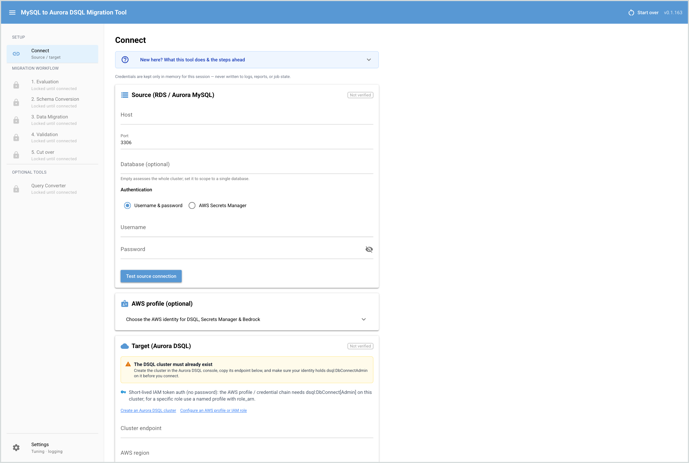

# Deployment Guide — MySQL → Aurora DSQL Migration Tool (app-stack)

_Language: **English** | [한국어](DEPLOYMENT.ko.md) | [日本語](DEPLOYMENT.ja.md)_

The tool runs in one of two ways: **locally** (`uv run …`, no infrastructure —
best for evaluation and small migrations) or on **ECS Fargate** (a hosted service
in your own AWS account — best for real, large-scale migrations). **This guide
covers the Fargate deployment (the app-stack);** for running locally, see
[Step 1](#step-1--choose-where-to-run) below and the root README.

On Fargate, the **control-plane app** runs as a single-task **Amazon ECS Fargate**
service behind an **Application Load Balancer (HTTPS)**, inside the customer's own
AWS account and VPC (single-tenant), with the image pulled from **Amazon ECR**. By
default the ALB is **`internal`** (no login needed — the network is the access
gate); **Amazon Cognito (OIDC)** login is an opt-in add-on, needed only if you
expose the UI publicly. The optional streaming **CDC pipeline** (MSK + Debezium +
sink) is a separate `cdc-stack`, not covered here.

---

## Quick deployment (TL;DR)

In a hurry? The happy path, in order — each step is detailed in the sections below.

1. Choose where to run (testing — Local; real migration — Fargate recommended).
2. Gather the required values.
3. Prepare an ACM certificate.
4. Upload the CloudFormation template.
5. Fill in the parameters.
6. Create the stack.
7. Open the tool URL (`AppUrl`).
8. (Optional) Enable public access, Cognito login, or AI assist.

---

## Step 1 — Choose where to run

- **Local** (testing / evaluation / development) — **one command, no
  infrastructure. 👉 Try this first, before you deploy to ECS Fargate.** See
  **[Step 2a](#step-2a--run-locally-try-this-first)**.
- **ECS Fargate — RECOMMENDED for production workloads** — the same engine runs as a single-task Fargate
  service + HTTPS ALB **inside your VPC**, so the data path stays in AWS (not your
  laptop). The real deployment. See
  **[Step 2b](#step-2b--deploy-on-ecs-fargate-recommended-for-production-workloads)**.

---

## Step 2a — Run locally (try this first)

**Before you commit to an ECS Fargate deployment, try it locally first** — **one
command and the UI is up. That's it.**

```console
$ uv run mysql-dsql-migrator ui
NiceGUI ready to go on http://127.0.0.1:8080
```

Open that URL in your browser and you're in — **no infrastructure, no build, no AWS
resources to create.** Great for a first look, evaluation, and smaller migrations
before deciding on Fargate.

<div align="center">
  
</div>

The UI runs on your own machine (browser → `127.0.0.1:8080`), and **the migration
itself runs there too**: your workstation is the engine that reads the source and
writes to DSQL, so all data flows through your machine and its network. This means
your **desktop must be able to reach _both_** the source MySQL **and** the target
Aurora DSQL — a private source needs an SSM port-forward / VPN, and your machine
needs outbound HTTPS + AWS credentials to the DSQL region. Zero infra — best for
evaluation / smaller migrations / development. It is *not* the hosted architecture;
for a real migration use ECS Fargate (**[Step 2b](#step-2b--deploy-on-ecs-fargate-recommended-for-production-workloads)**).

> **Tip — keep your session (and edits) across restarts.** Set
> `DSQL_MIGRATOR_STORAGE_SECRET` to a fixed random string before launching, e.g.
> `DSQL_MIGRATOR_STORAGE_SECRET=$(python -c "import secrets; print(secrets.token_urlsafe(32))") uv run mysql-dsql-migrator ui`.
> Without it, each restart gets a new browser-session id, so workflow progress
> **and your Schema Conversion edits (a customized target DDL — e.g. a
> `TINYINT(1)`→`smallint` remap)** are not restored, and a Full Load re-run would
> recreate the table from the default conversion. With it set, the session
> resumes where you left off and the re-run reuses your applied schema. (Treat
> the value as a secret; see [`.env.example`](../.env.example).)

---

## Step 2b — Deploy on ECS Fargate (recommended for production workloads)

No image build needed — the image is on **ECR Public** and CloudFormation pulls
it. Two ways to deploy the same `deploy/cloudformation.yaml`:

- **AWS Console — RECOMMENDED.** Upload the template; a guided form collects the
  values for you. See [Deploy the app-stack](#deploy-the-app-stack).
- **AWS CLI.** One `aws cloudformation deploy` command with parameter overrides.
  Also in [Deploy the app-stack](#deploy-the-app-stack).

First gather the values both paths need ([Prerequisites](#prerequisites) has the
details). **Start with the VPC** (recommended: the one your source DB lives in) —
then pick its ALB + task **subnets from that VPC** (in the Console they appear in a
dropdown once you choose the VpcId). Plus an **ACM certificate**, the **DSQL cluster
ARN**, and a **Secrets Manager secret ARN** for the source DB. Defaults handle the
rest (published image, `internal` ALB, Cognito off).

**Reaching the UI (internal ALB).** The ALB is internal by default, so browse
`https://<LoadBalancerDns>/` from **inside the VPC** — VPN / Direct Connect / SSM
port-forward. No public endpoint by design (Well-Architected SEC05-BP02). To
expose it publicly, see the override note under **Deploy the app-stack**.

### Prerequisites

#### Access

- **AWS Console** access (recommended path), **or** AWS CLI v2 authenticated to the
  target account (`aws sts get-caller-identity`).
- Permission to create the stack's resources: IAM roles, ECS, ELB (ALB), EC2
  security groups, CloudWatch Logs, and Cognito (optional — public ALB only).
- No image build needed — the image is pulled from ECR Public. (Building your own
  is only for a restricted network; see the Appendix.)

#### Required values

> 🔑 **Start with the VPC — everything else follows from it.** Use the **VPC your
> source RDS/Aurora MySQL already lives in**: same-VPC is the simplest and
> recommended choice (the tool reaches the source privately and you only open the
> source security group to the task). It **must be in the same region** as the DSQL
> target. **The two subnet fields below are picked _from this VPC_** — in the AWS
> Console they appear as a dropdown of that VPC's subnets once you choose the
> VpcId, so you select rather than type them. (A peered VPC / Transit Gateway /
> Direct Connect / VPN also works if routing + SGs let the task reach the source.)

| Required | Parameter | What it is |
| --- | --- | --- |
| **VPC** | `VpcId` | The VPC above — recommended: the source DB's VPC, same region as DSQL. **Must be owned by this account:** RAM-shared (cross-account) VPCs/subnets are not supported, because the CDC deploy role's EC2 permissions are scoped to resources in the deploying account, so the connector's ENI create would fail with `AccessDenied`. |
| **ALB subnets** | `AlbSubnetIds` | 2 subnets **of that VPC**, distinct AZs — private for an `internal` ALB (recommended), public for internet-facing. |
| **Task subnets** | `ServiceSubnetIds` | 2 private subnets **of that VPC**, distinct AZs, with **egress on 443** (NAT gateway or VPC endpoints) to reach DSQL / Secrets Manager / ECR / CloudWatch. |
| **ACM certificate** | `CertificateArn` | The **ARN** of an ACM certificate in the **same region** (`arn:aws:acm:<region>:<account>:certificate/<id>`) for the HTTPS listener. **Prod:** request a public ACM cert for a domain you own. **Quick test (no domain):** run `AWS_REGION=<region> deploy/create_test_cert.sh` and paste the `CertificateArn` it prints (self-signed; browsers warn). Copy an existing ARN from the ACM console. |
| **DSQL cluster ARN** | `DsqlClusterArn` | The target Aurora DSQL cluster. |

> **Source credentials** are entered in the UI **after** deploy (Connect step) —
> typically a **username/password** (the common case for RDS/Aurora MySQL), held in
> memory, no AWS secret needed. So `SourceSecretArn` is **optional** (next table):
> set it only to reuse an existing Secrets Manager secret.

> **Why these few are required (not just the VPC).** The subnets and certificate
> are required by AWS itself — an ALB and a Fargate task must be placed in subnets,
> and an HTTPS listener must have a certificate; CloudFormation can't auto-pick
> them from the VPC alone. The DSQL cluster ARN is the migration's **target**. The
> rest have defaults (next table).

#### Optional values (sensible defaults otherwise)

| Optional | Parameter | When you need it |
| --- | --- | --- |
| **Source secret ARN** | `SourceSecretArn` | Only to **reuse an existing** Secrets Manager secret for the source creds. Leave empty to use username/password in the UI (the common case). |
| **Source DB reachability** | `SourceDbSecurityGroupId` (preferred) / `SourceDbCidr` | **Provide at least one** so the task gets egress to the source MySQL on `SourceDbPort`. `SourceDbSecurityGroupId` scopes egress to the source DB's SG; use `SourceDbCidr` if you have no SG id. With both empty the deploy is rejected (the task would have no route to the source). |
| **Custom domain** | `AppDomainName` | Only if you front the ALB with your own Route 53 domain. |
| **Public access / Cognito** | `AlbScheme`, `AllowedIngressCidr`, `EnableCognitoAuth`, `CognitoDomainPrefix` | Only to expose the UI publicly; defaults keep it `internal` (no login). |
| **AI assist** | `EnableAiAssist`, `BedrockModelId`, `BedrockRegion` | Only to enable Amazon Bedrock-assisted conversion (pick a model; IAM scope auto-derived). |
| **Custom image / sizing** | `ContainerImageUri`, `ContainerCpu`, `ContainerMemory` | Only for a private-ECR image or non-default task size. |

### Deploy the app-stack

Two ways to deploy `deploy/cloudformation.yaml` — pick one. Both produce the same
stack; see **Parameter reference** below.

#### Recommended — AWS Console (guided form)

**At a glance** — upload the template, fill 5 fields, create, open the URL
(~5 min of clicks + ~3–5 min for the stack to come up):

1. **CloudFormation → Create stack → With new resources (standard).** Check the
   Region (top-right) matches your Aurora DSQL cluster.
2. **Upload a template file** → pick `deploy/cloudformation.yaml` → **Next**.
3. **Stack name** `mysql-dsql-migrator`, then fill the **5 fields that have no
   default** — `VpcId`, `AlbSubnetIds` (2 subnets, 2 AZs), `ServiceSubnetIds`
   (2 private subnets, 2 AZs), `CertificateArn`, `DsqlClusterArn` — **plus one of
   `SourceDbSecurityGroupId` (preferred) or `SourceDbCidr`**, which the template
   enforces on every deploy: with both empty the task has no route to the source
   MySQL and the connection times out. Leave everything else at its default →
   **Next**.
4. **Next** (stack options) → tick the **IAM-capabilities acknowledgement** →
   **Create stack**.
5. Wait for **CREATE_COMPLETE** → open the **Outputs** tab → copy **`AppUrl`** →
   browse it from inside the VPC. Done.

<!-- Screenshot slot: capture the CloudFormation "Create stack → Upload a template
     file" screen, save it as deploy/images/cfn-create-stack.png, then uncomment:

-->
> 📸 *A screenshot of the "Create stack → Upload a template file" screen belongs
> here (see the placeholder in the source).*

The field-by-field details, subnet-picking tips, the no-domain cert command, and
public-access options follow below.

First confirm you're in the **right region** (top-right of the console — the same
region as your Aurora DSQL cluster), then:

> **Before you start — have a `CertificateArn` ready.** The console can't generate
> the HTTPS cert for you. If you don't already have an ACM cert for a domain you
> own, run `AWS_REGION=<region> deploy/create_test_cert.sh` in a terminal first and
> keep the `arn:aws:acm:…` it prints to paste at step 3 (self-signed TEST cert —
> browsers warn; for prod, use a real ACM cert for your domain).
>
> **Reaching it from your desktop? Get your public IP too.** If you'll set
> `AlbScheme=internet-facing`, grab your IP now with
> `curl https://checkip.amazonaws.com` and enter `AllowedIngressCidr=<that-ip>/32`
> at step 3 so only you can reach the ALB. The default `10.0.0.0/8` is for an
> internal ALB (reached from inside the VPC/VPN) and will block a public browser.

**1. Open the Create stack wizard.** Go to the CloudFormation console:
<https://console.aws.amazon.com/cloudformation/home> → **Create stack** →
**With new resources (standard)**. (Direct link, swap your region:
`https://<region>.console.aws.amazon.com/cloudformation/home?region=<region>#/stacks/create`.)

**2. Prerequisite — Prepare template.** Choose **Template is ready**, then under
**Specify template** choose **Upload a template file** → **Choose file** →
select `deploy/cloudformation.yaml` from this repo → **Next**.

**3. Specify stack details.** Set the **Stack name** to `mysql-dsql-migrator`,
then fill the parameters. The form is grouped (Network / Migration endpoints /
TLS & access / Authentication / Container image & sizing / AI) with native
pickers, so you **select from your account** instead of typing ids.

**Fill these required fields** (everything else has a working default):

| Field | What to enter |
| --- | --- |
| `VpcId` | Dropdown — the VPC your source MySQL lives in. |
| `AlbSubnetIds` | Subnet multi-select — **2 subnets in distinct AZs** (see the subnet callout below). |
| `ServiceSubnetIds` | Subnet multi-select — **2 private subnets in distinct AZs** (or reuse the ALB subnets + set `AssignPublicIp=ENABLED` if you have no private/NAT subnets). |
| `CertificateArn` | ACM cert ARN for HTTPS — **no domain? see the command just below.** |
| `DsqlClusterArn` | The target Aurora DSQL cluster ARN. |

> ⚠️ The subnet dropdowns list **every subnet in the region**, not just your
> VpcId's. Picking one from another VPC fails the deploy — choose the right ones
> using the **"Which subnets to pick"** callout below.

**Recommended:** set `SourceDbSecurityGroupId` (or `SourceDbCidr`) so the task can
reach the source. Leave `SourceSecretArn` empty unless reusing an existing source
secret — you'll enter the source host/username/password in the UI after deploy.

**No ACM certificate yet?** Generate a self-signed **test** cert in one line, then
paste the ARN it prints into `CertificateArn` (browsers warn; test only):

```bash
AWS_REGION=<region> deploy/create_test_cert.sh
#  → prints:  CertificateArn=arn:aws:acm:<region>:<account>:certificate/xxxx
```

**Reaching the UI from your desktop browser?** The default is an `internal` ALB
(reachable only from inside the VPC/VPN). To open it from your own machine, set
these three together:

| Field | What to enter |
| --- | --- |
| `AlbScheme` | `internet-facing` |
| `AlbSubnetIds` | **public** subnets (not private) |
| `AllowedIngressCidr` | your desktop public IP as `/32` — get it with `curl https://checkip.amazonaws.com` (e.g. `203.0.113.5/32`) |

Leaving `AllowedIngressCidr` at its `10.0.0.0/8` default with an internet-facing
ALB blocks your browser; `0.0.0.0/0` (whole internet) additionally requires
`EnableCognitoAuth=true`.

Leave everything else at its default (published image, `internal` ALB, Cognito
off). In particular **keep `HttpsEgressCidr` at `0.0.0.0/0`** — it's the task's
outbound CIDR for reaching AWS APIs (DSQL, Secrets Manager, ECR, CloudWatch) via
NAT/IGW; only tighten it if you front all of those with VPC endpoints (PrivateLink),
otherwise the task can't pull its image or reach DSQL and fails to start. → **Next**.

> **Which subnets to pick.** The dropdown lists **every subnet in the region**
> (across all your VPCs), shown as `subnet-id | CIDR | Availability Zone | Name
> tag`. **First narrow to your VpcId's subnets by their CIDR range** (e.g. a VPC
> on `172.31.0.0/16` → pick the `172.31.x` subnets; ignore other CIDRs which belong
> to other VPCs). Then use the **AZ column** to satisfy "distinct AZs" and the
> **Name tag** to tell public from private. Pick by this table (the stack can't
> pre-flag them — AWS fills the dropdown from your account):
>
> | Field | Recommended subnets |
> | --- | --- |
> | `AlbSubnetIds` | **2 subnets in 2 different AZs.** For the default `internal` ALB use **private** subnets; for `internet-facing` use **public** ones. |
> | `ServiceSubnetIds` | **2 private subnets in 2 different AZs**, each with outbound 443 (a NAT gateway route, or VPC endpoints) so the task can reach DSQL / Secrets Manager / ECR. |
>
> Not sure which is which? Open the **VPC console → Subnets**, filter by your VPC,
> and check each subnet's AZ and route table (a `0.0.0.0/0 → nat-…` route = private
> with egress; `→ igw-…` = public). A clear Name-tag convention
> (e.g. `…-private-a` / `…-public-a`) makes the dropdown self-explanatory.

**4. Configure stack options.** Defaults are fine. Optionally add tags. → **Next**.

**5. Review and create.** Scroll to the bottom and **check the acknowledgement**
   "I acknowledge that AWS CloudFormation might create IAM resources with custom
   names" (`CAPABILITY_NAMED_IAM`). → **Submit**.

**6. Wait and get the URL.** The stack moves through `CREATE_IN_PROGRESS` →
   `CREATE_COMPLETE` (a few minutes; watch the **Events** tab). Then open the
   **Outputs** tab and copy **`AppUrl`** — that's your tool URL (reach it from
   inside the VPC; see "Reaching the UI" above).

**7. Open it — you should see the tool.** Browse `AppUrl` in a browser (from
   inside the VPC). The **MySQL → Aurora DSQL Migration Tool** UI loads — the
   guided workflow starting at **Connect** (Connect → Evaluation → Schema
   Conversion → Data Migration → Validation → Cut over). If it loads, the
   deployment is done; enter your source DB credentials at **Connect** to begin.

> **▶ Next: run your first migration.** Deployment ends here — the UI is up. For
> what each step does and how to drive an actual migration, follow the
> [**User Manual**](../docs/manual/en/README.md) (start at
> [Set up](../docs/manual/en/01-setup.md) → Connect).

For a **Prod profile**, additionally set `EnableCognitoAuth=true`,
`CognitoDomainPrefix`, **and `CognitoAdminEmail`** in step 3 (then do sections 4–5).
`CognitoAdminEmail` is not optional here — the template rejects Cognito without it,
because the user pool has no self sign-up and you would get an app with no way in.
`AppDomainName` stays optional: leave it empty to use the ALB's own DNS name.

#### AWS CLI

Set your environment as shell variables once; the command itself is identical for
every customer. The minimal (Dev/Test) deploy:

```bash
# --- Your environment (edit these) -------------------------------------------
export AWS_REGION=us-east-1
export VPC_ID=vpc-xxxxxxxx                               # recommended: the source DB's VPC
export ALB_SUBNET_IDS=subnet-aaaaaaa,subnet-bbbbbbb      # 2 subnets, distinct AZs
export SERVICE_SUBNET_IDS=subnet-ccccccc,subnet-ddddddd  # 2 private subnets
# CertificateArn: paste a real ACM cert ARN below, OR auto-fill a self-signed TEST
# cert (no domain needed) by capturing the script's output in one line instead:
#   export CERTIFICATE_ARN=$(deploy/create_test_cert.sh | sed -n 's/^CertificateArn=//p')
export CERTIFICATE_ARN=arn:aws:acm:us-east-1:<account>:certificate/xxxx
export DSQL_CLUSTER_ARN=arn:aws:dsql:us-east-1:<account>:cluster/xxxx
export SOURCE_DB_SG=sg-source
# -----------------------------------------------------------------------------

> **Stack name: use lower case, 28 characters or fewer.** The stack provisions its
> ALB as `<stack-name>-alb`, which the ALB service caps at 32 characters — a longer
> stack name fails the deploy, after a ~2 minute rollback, with
> `The load balancer name '<stack-name>-alb' cannot be longer than '32' characters`.
> Lower case matters too:
> the ALB's DNS name inherits the casing of its name, and Cognito login (if you enable
> it) only works when that DNS name is lower case, because the ALB sends the OAuth
> `redirect_uri` with the host lower-cased and Cognito compares the two exactly.

aws cloudformation deploy \
  --template-file deploy/cloudformation.yaml \
  --stack-name mysql-dsql-migrator \
  --region "$AWS_REGION" \
  --capabilities CAPABILITY_IAM CAPABILITY_NAMED_IAM \
  --parameter-overrides \
    VpcId="$VPC_ID" \
    AlbSubnetIds="$ALB_SUBNET_IDS" \
    ServiceSubnetIds="$SERVICE_SUBNET_IDS" \
    CertificateArn="$CERTIFICATE_ARN" \
    DsqlClusterArn="$DSQL_CLUSTER_ARN" \
    SourceDbSecurityGroupId="$SOURCE_DB_SG" \
    EnableAiAssist=true \
    BedrockRegion="$AWS_REGION" \
    BedrockModelId=global.anthropic.claude-sonnet-5
    # BedrockModelId default shown; other model choices in §8
    # SourceSecretArn=...   # optional — only to reuse an existing source secret
```

> **AI assist (recommended).** `EnableAiAssist=true` + `BedrockRegion` turns on the
> AI DBA for Schema Conversion and the Query Converter — an opt-in, advisory-only
> feature scoped to `bedrock:InvokeModel` for the selected model. You **must still
> enable model access** for `BedrockModelId` (default
> `global.anthropic.claude-sonnet-5`) in the Bedrock console for that region, and the
> task needs egress to the Bedrock endpoint. Omit both to deploy without AI (the
> deterministic path is unchanged). Full details + model choices in §8.

For a **Prod profile**, add: `EnableCognitoAuth=true`, `CognitoDomainPrefix=...`,
`CognitoAdminEmail=...` (all three are required together — the template enforces it),
plus optionally `AppDomainName=...` for a custom domain and `ContainerImageUri=...`
for your own image.

> **Test shortcuts / overrides**
>
> - **No ACM cert / domain:** `AWS_REGION=us-east-1 deploy/create_test_cert.sh`
>   imports a self-signed cert; use its `CertificateArn` (browsers warn; test only).
> - **No NAT gateway:** set `AssignPublicIp=ENABLED` and put `ServiceSubnetIds` in
>   public subnets (the task is still only reachable via the ALB SG).
> - **Public UI (from your desktop):** `AlbScheme=internet-facing` **and**
>   `AllowedIngressCidr=<your-public-ip>/32` (get it: `curl https://checkip.amazonaws.com`).
>   The default `10.0.0.0/8` is internal-only and blocks public browsers; never use
>   `0.0.0.0/0` (fully-open additionally requires `EnableCognitoAuth=true`).
> - **Restricted network (no ECR Public):** override `ContainerImageUri` with your
>   own private ECR copy ([pull-through cache](https://docs.aws.amazon.com/AmazonECR/latest/userguide/pull-through-cache.html)
>   or build from `deploy/Dockerfile`, see the Appendix).

Validate the template first if you like:

```bash
aws cloudformation validate-template \
  --template-body file://deploy/cloudformation.yaml --region "$AWS_REGION"
```

Read the outputs after it completes:

```bash
aws cloudformation describe-stacks --stack-name mysql-dsql-migrator \
  --region "$AWS_REGION" --query 'Stacks[0].Outputs' --output table
```

Key outputs: `LoadBalancerDns`, `AppUrl`, `ClusterName`, `ServiceName`,
`TaskRoleArn`, `CognitoHostedUiDomain`.

Open **`AppUrl`** in a browser (from inside the VPC). The **MySQL → Aurora DSQL
Migration Tool** UI loads — the guided workflow starting at **Connect** (Connect
→ Evaluation → Schema Conversion → Data Migration → Validation → Cut
over). Seeing the UI means the deployment succeeded; enter your source DB
credentials at **Connect** to begin.

### Parameter reference

| Parameter | Required | Default | Description |
| --- | --- | --- | --- |
| `VpcId` | yes | — | VPC that can reach the source DB privately. |
| `AlbSubnetIds` | yes | — | ≥2 subnets (distinct AZs) for the ALB. |
| `ServiceSubnetIds` | yes | — | Private subnets for the Fargate task. |
| `AlbScheme` | no | `internal` | `internal` or `internet-facing`. **Recommended: `internal`** (reach via VPN/Direct Connect/peering); use `internet-facing` only with Cognito on. |
| `CertificateArn` | yes | — | ACM cert ARN for the HTTPS (443) listener. |
| `ContainerImageUri` | no | published ECR Public image | Defaults to the image published on ECR Public — no build needed. Override only for a restricted network (your private ECR copy / pull-through cache) or a custom build; prefer an immutable tag or digest. |
| `ContainerCpu` | no | `512` | Fargate task CPU units. **Full Load is CPU-bound** (the source reader does per-row type conversion in Python), so raise this for a large migration — a measured payments+orders load ran **~3.8× faster at 4096 (4 vCPU) than at the 512 default** on the same data. Default `512` is fine for evaluation; use **4096 or higher** for a real large-scale Full Load. See [manual §7.2](../docs/manual/en/07-performance-and-tuning.md#72-tuning-parallelism). |
| `ContainerMemory` | no | `1024` | Fargate task memory (MiB) — a **hard limit**: exceed it and the kernel OOM-kills the task (no graceful shutdown, only a CloudWatch spike + ELB timeout). Memory is bounded by the buffered pipeline — roughly `table_parallelism × (prefetch + batch_parallelism) × per-batch-bytes` **summed across the worker processes**, not by table size — and **wide / oversized-LOB rows push per-batch bytes up**, so the `1024` default can be tight for a real load with concurrent source writes. **Sizing:** `1024` is fine for evaluation / small tables; use **≥ 2048** for a real Full Load, and **≥ 4096** (which also needs `ContainerCpu` ≥ 2048) when tables have large `TEXT`/`BLOB` values or you raise the parallelism settings. Must be valid for the CPU (Fargate pairs `512` CPU with 1–4 GB, `1024` with 2–8 GB, `2048` with 4–16 GB, `4096` with 8–30 GB — see the sizing table below). The app logs a memory high-water and an ~80% pressure warning (in the activity log too) so an approaching OOM is visible before the kill. |
| `AppPort` | no | `8080` | Container listen port. |
| `AssignPublicIp` | no | `DISABLED` | `ENABLED` to run the task in public subnets without a NAT (test); **recommended: keep `DISABLED`** for production (NAT gateway or VPC endpoints). |
| `AllowedIngressCidr` | no | `10.0.0.0/8` | CIDR allowed to reach the ALB on 443. **Recommended: scope to your network**, not `0.0.0.0/0`. |
| `DsqlClusterArn` | yes | — | Target DSQL cluster ARN (scopes `dsql:DbConnect`). |
| `SourceSecretArn` | no | `""` | **Optional.** Set only to **reuse an existing** Secrets Manager secret for the source creds (scopes `GetSecretValue`). Leave empty to enter username/password in the UI (the common case). |
| `SourceDbSecurityGroupId` | no* | `""` | Source DB SG; **preferred (recommended) egress target** over a raw CIDR. *One of this / `SourceDbCidr` is required. |
| `SourceDbCidr` | no* | `""` | Source DB CIDR (use if no SG id). *One of this / `SourceDbSecurityGroupId` is required. |
| `SourceDbPort` | no | `3306` | Source MySQL port. |
| `HttpsEgressCidr` | no | `0.0.0.0/0` | Destination CIDR for the task's outbound 443 (AWS APIs: DSQL token, Secrets Manager, ECR, CloudWatch, Bedrock) and 5432 (DSQL). **Recommended: leave the `0.0.0.0/0` default** — the task reaches public AWS endpoints via NAT/IGW. Only tighten (e.g. to your VPC CIDR) when you front *all* those services with interface VPC endpoints (PrivateLink); tightening without them blocks image pull / DSQL and the task fails to start. |
| `EnableCognitoAuth` | no | `false` | ALB authenticates via Cognito (OIDC). Defaults to `false`: an internal ALB (or one scoped to your CIDR) is the access gate and the operator already holds the IAM/DB permissions, so no login is needed. **Required (enforced) only when `AllowedIngressCidr=0.0.0.0/0`.** Needs **both** `CognitoDomainPrefix` and `CognitoAdminEmail` when `true`. |
| `AppDomainName` | no | `""` | DNS name fronting the ALB (must match the cert). Leave **empty** to use the ALB's own DNS name as the Cognito callback host — then no custom domain or Route 53 record is needed. |
| `CognitoDomainPrefix` | if Cognito | `""` | Globally-unique Cognito hosted-UI prefix (`https://<prefix>.auth.<region>.amazoncognito.com`). |
| `CognitoAdminEmail` | if Cognito | `""` | Email of the **first login user**, created by the stack. Cognito mails it a temporary password; the hosted UI asks for a new one on first sign-in. **Required with Cognito** — the user pool disables self sign-up, so without it the deploy succeeds and produces an app nobody can log in to (the template rejects that combination). Add more users later — see [§Create operator users](#create-operator-users-cognito--only-with-cognito). |
| `EnableAiAssist` | no | `false` | Opt-in; grants scoped `bedrock:InvokeModel`. |
| `BedrockModelArns` | no | `""` | **Optional override** of the invoke scope; blank = auto-derived from `BedrockModelId`. |
| `BedrockRegion` | no | `""` | `BEDROCK_REGION` for the app. |
| `BedrockModelId` | no | `global.anthropic.claude-sonnet-5` | Anthropic model (dropdown); IAM scope auto-derived from it. |

### Task sizing — `ContainerCpu` / `ContainerMemory`

Fargate does **not** let you pick CPU and memory independently: each CPU value allows
only a fixed memory range, and memory is a **hard limit** (over it → OOM kill, no app
shutdown). Pick a valid pair:

| `ContainerCpu` (vCPU) | Allowed `ContainerMemory` | Step |
| --- | --- | --- |
| `256` (0.25) | 512, 1024, 2048 MiB | fixed |
| `512` (0.5) | 1–4 GB | 1 GB |
| `1024` (1) | 2–8 GB | 1 GB |
| `2048` (2) | 4–16 GB | 1 GB |
| `4096` (4) | 8–30 GB | 1 GB |
| `8192` (8) | 16–60 GB | 4 GB |
| `16384` (16) | 32–120 GB | 8 GB |

**Recommended by workload:**

- **Evaluation / small tables:** the `512` / `1024` MiB default is fine.
- **Real Full Load:** **`1024` CPU / `2048` MiB** or higher. Full Load is CPU-bound
  (per-row type conversion) and memory grows with `table_parallelism × batch_parallelism`
  across worker processes — the `512`/`1024` default has OOM-killed a load that ran with
  concurrent source writes.
- **Large tables with big `TEXT`/`BLOB`, or raised parallelism:** **`4096` CPU /
  `8192`+ MiB** — wide rows enlarge each buffered batch. (To go above 4 GB memory you
  must also raise CPU: 4 GB needs CPU ≥ `1024`, 8 GB needs CPU ≥ `2048`.)

> Memory to raise it is a **redeploy** (the stack updates the task in place) — Fargate
> does not auto-scale a task's memory, and this single-task control plane does not scale
> horizontally. If unsure, size up: an over-provisioned task only costs a little more,
> an under-provisioned one OOM-kills mid-migration. The app logs a memory high-water and
> an ~80% pressure warning (also on the activity log) so you can right-size from evidence.

### Point DNS at the ALB — optional (custom domain only)

Only when you set `AppDomainName` (your own domain). **Skip this with the default
setup** — you reach the app at the ALB DNS name (the `AppUrl` output) directly.

Create a Route 53 **alias A record** for `AppDomainName` targeting the ALB
(`LoadBalancerDns`). The name must match `CertificateArn`. Example
(alias to an internal ALB in your private zone):

```bash
aws elbv2 describe-load-balancers \
  --names "$(aws cloudformation describe-stack-resource \
    --stack-name mysql-dsql-migrator --logical-resource-id LoadBalancer \
    --query 'StackResourceDetail.PhysicalResourceId' --output text)" \
  --query 'LoadBalancers[0].[DNSName,CanonicalHostedZoneId]' --output text
```

Use the returned DNS name + hosted-zone id to create the alias record (console
or `aws route53 change-resource-record-sets`).

### Create operator users (Cognito) — only with Cognito

Only when you enabled Cognito (`EnableCognitoAuth=true`). Skip this with the default
`internal` ALB and no Cognito.

**The first user already exists** — the stack created it from `CognitoAdminEmail`, and
Cognito emailed a temporary password to that address. Check the **`CognitoFirstUser`**
stack output for which address it went to. To log in, open `AppUrl`, sign in with that
email + the temporary password, and set a new password when prompted.

To add **more** users, use the `CognitoUserPoolId` stack output:

```bash
POOL_ID=$(aws cloudformation describe-stacks --stack-name mysql-dsql-migrator \
  --query "Stacks[0].Outputs[?OutputKey=='CognitoUserPoolId'].OutputValue | [0]" \
  --output text)

aws cognito-idp admin-create-user \
  --user-pool-id "$POOL_ID" \
  --username operator@example.com \
  --user-attributes Name=email,Value=operator@example.com Name=email_verified,Value=true \
  --desired-delivery-mediums EMAIL
```

Each user receives a temporary password and is prompted to set a new one on first
sign-in via the Cognito hosted UI (triggered by the ALB). The pool has **self sign-up
disabled**, so every user must be created this way.

### Verify

```bash
# ECS service should reach runningCount = desiredCount (1) and be ACTIVE.
aws ecs describe-services --cluster "$(... ClusterName ...)" \
  --services "$(... ServiceName ...)" \
  --query 'services[0].[status,desiredCount,runningCount]' --output text

# Tail application logs.
aws logs tail /ecs/mysql-dsql-migrator-mysql-dsql-migrator --follow --region "$AWS_REGION"
```

Then open `https://AppDomainName/` from a host inside the allowed network
(`AllowedIngressCidr`). You should be redirected to Cognito sign-in (if enabled)
and then to the migration workflow (Connect → Evaluation → Schema
Conversion → Data Migration → Validation → Cut over).

#### Observability & runtime diagnostics

Deployment is deliberately parameter-light: **log level and CloudWatch
mirroring of the activity log are not CloudFormation parameters** — adjust them
at runtime from **Settings → Diagnostics** in the app (the gear in the sidebar
footer), no redeploy:

- **Log level** — flip `INFO`/`DEBUG` while troubleshooting (DEBUG adds Python
  stacktraces to failure events; never row values or credentials).
- **Send to CloudWatch (stdout)** — toggle on to stream the activity log to
  stdout, which the container's `awslogs` driver forwards to this stack's
  CloudWatch log group (a durable audit copy that survives task replacement).
- **Download activity log** — pull the full UTC, one-line-per-event timeline
  (connection / assessment / schema apply / Full Load / CDC) from the
  **Activity log** tab of the same dialog. The file is size-capped and rotated
  on `/tmp`.

Changes apply app-wide (single task) and reset to startup defaults on restart;
advanced operators can set the startup defaults via the
`DSQL_MIGRATOR_LOG_LEVEL` / `DSQL_MIGRATOR_ACTIVITY_LOG_STDOUT` environment
variables, but the Settings dialog is the intended path.

### Update to a new image version

Build and push a new tag, then redeploy with the new `ContainerImageUri`. ECS
performs a rolling replacement of the task:

```bash
export IMAGE_TAG=0.1.1
export IMAGE_URI="$ACCOUNT.dkr.ecr.$AWS_REGION.amazonaws.com/$ECR_REPO:$IMAGE_TAG"
docker build -f deploy/Dockerfile -t "$ECR_REPO:$IMAGE_TAG" .
docker tag "$ECR_REPO:$IMAGE_TAG" "$IMAGE_URI"
docker push "$IMAGE_URI"

aws cloudformation deploy \
  --template-file deploy/cloudformation.yaml \
  --stack-name mysql-dsql-migrator --region "$AWS_REGION" \
  --capabilities CAPABILITY_IAM \
  --parameter-overrides ContainerImageUri=$IMAGE_URI
  # (re-supply the other parameters, or rely on previous values)
```

> The control plane runs as a **single task**, so expect a brief interruption
> during replacement. Your migrated data, the DSQL cluster, and a deployed
> cdc-stack are unaffected and recovered on reconnect. In-flight session state
> (workflow progress, an in-progress Full Load) lives on the task's ephemeral disk
> and does **not** survive — **finish or quiesce in-flight jobs before updating**,
> then reconnect and re-run the read-only Evaluation (minutes).

### Enable AI-assisted conversion (optional)

AI assist is opt-in and grants a **scoped** `bedrock:InvokeModel`:

```bash
aws cloudformation deploy ... \
  --parameter-overrides \
    EnableAiAssist=true \
    BedrockModelId=global.anthropic.claude-sonnet-5 \
    BedrockRegion=$AWS_REGION
```

**AI assist runs only on Amazon Bedrock.** Bedrock is the sole AI backend — the
tool has no field for a direct Anthropic/OpenAI (or any other) API key, so the
only model you can select is a Bedrock foundation model invoked with your AWS
credentials. Set the model with `BedrockModelId` (default
`global.anthropic.claude-sonnet-5`).

**Recommended models — the latest Anthropic Claude Opus or Sonnet:**

| Model | Bedrock model id (`BedrockModelId`) | When to use |
|---|---|---|
| Claude Sonnet 5 (default) | `global.anthropic.claude-sonnet-5` | Best balance of quality, speed, and cost for most schemas. |
| Claude Opus 5 | `global.anthropic.claude-opus-5` | Hardest `MANUAL` / `UNSUPPORTED` conversions; highest quality. |
| Claude Opus 4.8 | `global.anthropic.claude-opus-4-8` | High quality; a step below Opus 5. |
| Claude Sonnet 4.6 | `global.anthropic.claude-sonnet-4-6` | Previous-generation Sonnet. |

`BedrockModelId` is a **dropdown** of these `global.` cross-region inference profiles
(they resolve from every commercial region, so one list serves any deploy),
and the task role's `bedrock:InvokeModel` scope is **derived from it
automatically** — so you do **not** set `BedrockModelArns` (use it only to
override with a different model/ARNs). You **must still enable model access** for
the chosen model in the Bedrock console for `BedrockRegion`.

Ensure task egress can reach the Bedrock runtime endpoint (NAT or a Bedrock VPC
endpoint). Enable AI in the UI; use the **Verify AI access** preflight to
confirm reachability.

### Teardown

> **Complete teardown order (remove ALL resources / stop ALL cost).** The
> migration uses up to three stacks; remove them in this order so nothing — and no
> cost — is left behind:
>
> 1. **cdc-stack first (if you ever deployed CDC)** — this is the costly one
>    (Amazon MSK / MSK Connect / NAT). Remove it **while the app is still up**, from
>    the UI: **Start over (top right) → "Delete all CDC infrastructure"** (the app
>    drives the `cdc-stack` deletion, ~15–25 min). If the app is already gone, delete it
>    manually: `aws cloudformation delete-stack --stack-name mysql-dsql-cdc-stack --region "$AWS_REGION"`.
>    (CDC is the separate `cdc-stack`; see the CDC docs.)
> 2. **app-stack** — `deploy/teardown.sh` (below).
> 3. **build-stack** — only if you used Option B (CodeBuild) (below).
> 4. **Verify nothing is left** — no `mysql-dsql-*` CloudFormation stacks remain
>    (`aws cloudformation list-stacks --query "StackSummaries[?starts_with(StackName,\`mysql-dsql\`) && StackStatus!=\`DELETE_COMPLETE\`].StackName"`),
>    plus any **Route 53** records and the **CodeBuild source S3 bucket** you created.

Use the helper script (deletes the stack and waits; keeps the ECR repo by
default):

```bash
export AWS_REGION=us-east-1
deploy/teardown.sh mysql-dsql-migrator          # delete the stack only
DELETE_ECR=true deploy/teardown.sh mysql-dsql-migrator   # also remove the ECR repo + images
```

Route 53 records you created manually must be removed manually.

If you used **Option B (CodeBuild)**, also delete the build stack (its ECR repo
has `EmptyOnDelete`, so images are removed with it):

```bash
aws cloudformation delete-stack --stack-name mysql-dsql-migrator-build --region "$AWS_REGION"
```

### Troubleshooting

| Symptom | Likely cause / fix |
| --- | --- |
| Service never reaches `runningCount=1` | Image pull failed (check `ContainerImageUri`, execution role, ECR egress/VPC endpoints) — see ECS service events. |
| Task stuck pulling image / no egress (private subnets, no NAT) | Either add a NAT gateway or VPC endpoints (ecr.api, ecr.dkr, S3 gateway, logs, secretsmanager, sts), or for a test set `AssignPublicIp=ENABLED` with `ServiceSubnetIds` in public subnets. |
| Task stops with `exec format error` | Image architecture mismatch. `build_and_push.sh` builds `linux/amd64` to match the task's default X86_64; only set `IMAGE_PLATFORM=linux/arm64` if the task runs on ARM64/Graviton. |
| `docker: command not found` when building | No local container runtime. Either install one (Option A: `brew install colima docker && colima start`) or use Option B (CodeBuild) to build in the cloud with no local Docker. |
| Target group unhealthy / 502 | App not listening on `0.0.0.0:AppPort`, or health check path `/` failing — check container logs. |
| 504 / timeout from ALB | Task SG does not allow inbound from the ALB SG, or task is in a subnet without egress. |
| Cognito redirect loop / 401 | `AppDomainName` must match the cert and the Cognito callback `https://AppDomainName/oauth2/idpresponse`; user not created/confirmed. |
| App cannot reach the source DB | Source DB SG must allow inbound on `SourceDbPort` from the task SG; verify `SourceDbSecurityGroupId`/`SourceDbCidr`. |
| DSQL auth errors | `DsqlClusterArn` scope, region (`DSQL_MIGRATOR_AWS_REGION`), and task-role `dsql:DbConnect`. |
| Bedrock errors when AI on | `BedrockModelArns` scope, model enabled in `BedrockRegion`, and egress to the Bedrock endpoint. |
| Need more detail when diagnosing a failure | Set log level to `DEBUG` under **Settings → Diagnostics** (the gear in the sidebar footer) to add Python stacktraces to activity-log failure events; toggle "Send to CloudWatch (stdout)" for a durable copy. No redeploy. |

### Security notes

- **Least privilege**: the task role grants only `dsql:DbConnect` +
  `dsql:DbConnectAdmin` (scoped to the cluster; the app connects as the DSQL
  `admin` role by default), the read-only `dsql:GetCluster` +
  `dsql:ListTagsForResource` (scoped to the cluster; used only to show the
  cluster's `Name` tag on the overview diagram), and
  `secretsmanager:GetSecretValue` (scoped to the
  source secret); `bedrock:InvokeModel` is added only when AI assist is enabled
  and is scoped to the allowed model ARN(s). A separate execution role handles
  ECR pull + logs and reads only the auto-generated session-cookie secret
  (scoped `secretsmanager:GetSecretValue`) to inject it at container start.
- **Auto-generated session-cookie secret**: the stack creates an
  `AWS::SecretsManager::Secret` (no operator input) that signs the browser
  session cookie (`DSQL_MIGRATOR_STORAGE_SECRET`), so the browser session id stays
  stable across restarts — the key under which the durable snapshot (next bullet)
  is found. It signs the cookie only — no DB/user credentials — and is never
  plaintext in the template.
- **Durable session resume**: each session's non-secret workbench snapshot
  (workflow progress, Evaluation result, schema choices, CDC start point) is
  written to the tool's managed plugin bucket
  (`mysql-dsql-migrator-plugins-<account>-<region>`, auto-provisioned — no operator
  input) under a `sessions/` prefix, so it survives a Fargate **task replacement**
  (a redeploy), not just an in-task restart. Combined with the stable cookie secret
  above, a reconnecting browser resumes its workbench instead of re-running Step 1
  (Evaluation). Non-secret only (Property 7) — the source DB password is re-entered
  on the Connect screen.
- **Audit trail**: the structured activity log (success + failure timeline,
  downloadable from the UI) records non-secret fields only — never row values,
  passwords, or IAM tokens. It is size-capped and rotated on the task's
  ephemeral disk; enable the CloudWatch mirror (see **Verify**) for a durable
  copy.
- **Network**: the ALB accepts 443 only from `AllowedIngressCidr`; the task
  accepts traffic only from the ALB; task egress is scoped to the source DB
  (`SourceDbPort`), outbound 443 (AWS endpoints), and 5432 (the Aurora DSQL
  endpoint). Prefer an `internal` ALB.
- **Credentials are never stored** in the template or image; the app reads the
  source secret at runtime and authenticates to DSQL with short-lived IAM
  tokens.
- **Container image CVEs (perl).** An ECR scan of the app image flags several
  `perl` CVEs (e.g. CVE-2026-12087, CVE-2026-489xx) against the base image's
  `perl 5.40.1-6`. `perl` is a **transitive package of the `python:3.12-slim`
  (Debian trixie) base**, not something the tool uses — the app is **pure Python
  and never invokes perl**, so the vulnerable code paths are **unreachable** in
  this container. The `Dockerfile` runtime stage runs `apt-get upgrade` at build
  time, so a rebuild adopts the fix automatically once Debian ships it; as of now
  these CVEs are still **open in Debian trixie/sid** (no fixed `perl` exists to
  upgrade to), so the scan cannot be cleared today by any image rebuild. If your
  compliance posture requires a clean scan before then, rebuild on a base without
  perl (e.g. a distroless Python image) — note this is a larger change that needs
  its own validation.
- This stack has **not** been deployed from this repository — validate it in
  your target account before production use.


---

## Appendix — Build your own image (restricted network only)

> **Most deployments skip this section.** The image is published to ECR Public and
> CloudFormation pulls it by default — you build nothing. Build your own image only
> if your network can't reach ECR Public (then pass the result as
> `ContainerImageUri`). Pick Option A or B below; both create the ECR repository,
> build `deploy/Dockerfile` for `linux/amd64`, push to ECR, and print the image URI.

### Option A — local build (requires a Docker-compatible runtime)

```bash
export AWS_REGION=us-east-1
deploy/build_and_push.sh            # tag defaults to the project version
# or pin an explicit tag:
deploy/build_and_push.sh 0.1.0
```

<!-- markdownlint-disable-next-line -->
Requires a running `docker` daemon (Docker Desktop, or `brew install colima
docker && colima start`).

### Option B — cloud build with AWS CodeBuild (no local Docker)

Deploy the build infrastructure once (ECR repo + S3 source bucket + CodeBuild
project), then run the helper to zip the source, upload it, and start a build:

```bash
export AWS_REGION=us-east-1

# One-time: provision the build infrastructure.
aws cloudformation deploy \
  --template-file deploy/codebuild.yaml \
  --stack-name mysql-dsql-migrator-build \
  --capabilities CAPABILITY_IAM \
  --region "$AWS_REGION"

# Each build: zip + upload source, run CodeBuild, wait, print the image URI.
deploy/build_in_codebuild.sh            # tag defaults to the project version
# or pin an explicit tag:
deploy/build_in_codebuild.sh 0.1.0
```

CodeBuild runs Docker in its managed (privileged) environment, so your machine
only needs the AWS CLI. The image is built for `linux/amd64` and pushed to the
same ECR repository.

> Use an immutable tag (or an image digest) per release so deployments are
> reproducible.
