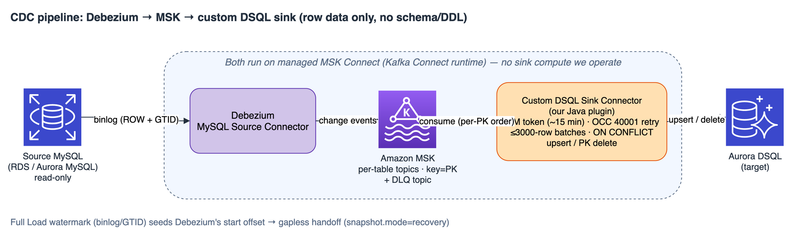

# 4. CDC の動作と DSQL 制約の処理方法

_言語: [English](../en/04-cdc-and-dsql-constraints.md) | [한국어](../ko/04-cdc-and-dsql-constraints.md) | **日本語**_

> **前へ:** [3. Full Load](03-full-load.md)

**CDC (Change Data Capture)** は、ほぼ無停止のカットオーバーを実現するための **オプション** のストリーミングパイプラインです。Full Load が既存の行をコピーした後、CDC はソース側で発生するすべての新規 insert/update/delete を反映し、DSQL を継続的に最新の状態に保ちます。これにより、長時間の停止を伴わず、最小限のダウンタイムでカットオーバーできます。

CDC が必要になるのは、**大規模または継続的な** マイグレーションの場合だけです。短時間の凍結が許容される一回限りのカットオーバーであれば、Full Load だけで十分です。

---

## 4.1 パイプライン

  

- **Debezium MySQL source connector** は、ソースのバイナリログを読み取り専用で読み込み、変更イベントを出力します。
- **Amazon MSK (Kafka)** は耐久性のあるバックボーンです。**テーブルごとに 1 トピック** を持ち、主キーでキーイングし (ある行のすべての変更が 1 つのパーティションで順序を保つ)、加えてデッドレター (DLQ) トピックを備えます。
- **カスタム DSQL sink connector** — このプロジェクトが所有する Java Kafka Connect プラグイン — が変更を DSQL に適用します。両方の connector は **マネージドの MSK Connect** 上で実行され、ツール自身は **sink 用のコンピュートを一切持たず**、コントロールプレーンとして機能します (構成の作成、開始オフセットのシード、監視を行います)。

**なぜ標準的な JDBC sink ではなく *カスタム* sink なのでしょうか。**

標準的な JDBC sink は楽観的並行性の競合 (`SQLSTATE 40001`) を **バッチ単位で** リトライするため、競合の激しい TB 規模の CDC ではスループットが崩壊します。カスタム sink は **ステートメント単位で** リトライし、DSQL の短命な IAM トークン、≤3000 行のバッチ、再接続を処理します (詳細は §4.4)。

---

## 4.2 CDC は *スキーマ* ではなく *データ* を複製する — 重要

CDC は **行レベルのデータ変更** (insert / update / delete) を複製します。SQL 文や **DDL** は複製 **しません**。具体的には次のとおりです。

- Debezium は `include.schema.changes=false` で実行され、sink は DML のみを適用します。
- ソースの **DDL** (`ALTER TABLE`、`CREATE`、`DROP` など) は DSQL に **伝播されません**。

DSQL のターゲットスキーマは **Schema Conversion** ステップの実行時に固定されます。**CDC の実行中にソースのスキーマを変更する場合** は、同等の DDL を (Schema Conversion 経由で) **先に** DSQL 自身に適用してください。適用するまでの間、ターゲットの形状に合致しなくなった行 (たとえば新しい列を参照する行) は失われるのではなく **DLQ** に隔離されます — サイレントではなく可視化されます。

---

## 4.3 ギャップのない Full Load → CDC ハンドオフ

これは、バルクロードとストリームの間で **変更の取りこぼしも重複もない** ように設計された部分です。

1. Full Load は、スナップショット時点で **ウォーターマーク (watermark)** (binlog 位置 + GTID) をキャプチャしました ([第 3 章 §3.5](03-full-load.md#35-ウォーターマーク--cdc-への橋渡し))。
2. CDC を開始すると、ツールは connector の **開始オフセットを正確にそのウォーターマークにシード** します (source connector が開始する前に、VPC 内の Lambda がオフセットレコードを書き込みます)。これにより Debezium は **スナップショット後の最初の変更** からストリーミングを開始します — 「今」からでもなく、データを再読み込みするのでもありません。
3. source connector は **`snapshot.mode=recovery`** で実行されます。オフセットがすでにシードされているため、Debezium は (binlog イベントをデコードするために) 内部の **スキーマ履歴** を **現在のソーステーブル** から再構築し、**行データを一切再読み込みせずに** シードされたオフセットから再開します。

その結果、スナップショットと「今」の間のすべての変更が正確に 1 回だけ適用されます。sink の適用は (PK でキーイングされ) **冪等** であるため、オーバーラップやリトライがあっても重複が生じることはありません。

> **ウォーターマーク位置の binlog は、CDC 開始時点でまだ存在している必要があります。** このハンドオフは、ソースがウォーターマーク位置のバイナリログをまだパージしていない場合にのみ機能します。RDS/Aurora はデフォルトで binlog を積極的にパージし (Aurora MySQL は 24 時間保持)、CDC スタックのデプロイには約 15〜20 分かかるため、**開始前に binlog の保持期間を延長してください** — [§1.1](01-setup.md#11-前提条件) を参照してください。該当セグメントがすでに失われている場合、CDC はギャップなく再開できないため、新しいウォーターマークを取得するために Full Load を再実行することになります。

> **なぜ単純な schema-only 開始ではなく `recovery` なのか。** シードされたオフセットが存在すると、Debezium は「再開」パスをたどり、既存のスキーマ履歴トピックを期待します。`recovery` は、行を再スナップショットせずにその履歴をライブのデータベースから再構築するモードです — まさに「データは自分ですでにロード済みなので、このオフセットから再開するだけでよい」という状況に合致します。

---

## 4.4 sink がデータパスで DSQL の制約を処理する方法

DSQL は分散型かつ PostgreSQL 互換であるため、sink は従来の MySQL/JDBC ライターのようには動作できません。各制約に対する処理は次のとおりです。

| DSQL の制約 | カスタム sink の処理方法 |
|---|---|
| **IAM トークン認証 (パスワードなし)** | 短命な IAM トークン (admin または standard) を生成し、TLS 経由の JDBC パスワードとして使用します。**有効期限前に更新** し (15 分のトークン、2 分の更新マージン)、長時間実行される CDC が期限切れトークンで停止しないようにします。 |
| **楽観的並行性制御 (ロックなし)** | `SQLSTATE 40001` の場合、バッチ全体ではなく **ステートメント単位で** 指数バックオフ + ジッターによりリトライします (最大 10 回)。これが競合下でのスループットの決定的な違いです。 |
| **トランザクションあたり ≤ 3000 行** | ≤ 3000 行のチャンク単位で適用し (デフォルトバッチは 3000)、チャンクごとに 1 回 `commit()` します。 |
| **ステートメント単位の UPDATE / リプレイなし** | すべての変更は **PK でキーイングされた冪等な upsert または delete** です。insert/update には `INSERT ... ON CONFLICT (pk) DO UPDATE`、delete には `DELETE ... WHERE pk = ?` (および Kafka のトゥームストーン) を使用します。同じイベントの再適用は安全です。 |
| **接続の切断 (アイドルクローズ / トークン期限切れ / ワーカー再生成)** | 切断された接続やハーフオープンの接続を検出し、新しいトークンで再接続して **同じオフセットをリプレイ** します (適用が冪等なため安全)。レコードを破棄することはありません。接続エラーは一時的なものとして扱ってリトライし、poison row と誤認しません。 |

---

## 4.5 値ごとの 1 MiB 上限、および DLQ

DSQL は **約 1 MiB を超える単一の値** (`TEXT`/`bytea` 値) を拒否します。パイプラインは特大サイズの値を **3 つの帯域** に分けて処理します。

| 値のサイズ | 処理内容 |
|---|---|
| **≤ 1 MiB** | 通常どおり適用されます。 |
| **1 MiB – 8 MiB** | sink は **書き込み前に** 各値を測定し、特大サイズの値を **DLQ** に **隔離 (quarantine)** します (適用されることは決してありません)。一方でそのレコードのテーブルの残りの値はそのまま流れ続けます。そのようなレコードがデッドレター化のために Kafka を通過できるように、テーブルごとのトピックとクライアントの上限が引き上げられます (デフォルト 4 MiB、最大 8 MiB)。 |
| **> 8 MiB** | Kafka にまったく入ることができません。これらは **キャプチャ時に除外** する必要があります。Debezium の `column.exclude.list` が特大サイズの LOB 列をドロップし (Evaluation の `OVERSIZED_LOB` フラグにより駆動)、パイプラインに到達しないようにします。 |

### デッドレター化される対象

特大サイズの値に加えて、DLQ は DSQL が **恒久的に** 拒否するあらゆるレコードを隔離します — 型の不一致、制約違反、ターゲット列の欠落 (たとえば伝播されていないソースの `ALTER` の後) などです。一時的な失敗 (OCC `40001`、接続の切断) は **リトライ** され、デッドレター化はされません。

### DLQ が表面化する場所 — 読み取る Kafka トピックではなく CloudWatch

sink は隔離した各レコードをその **CloudWatch** connector ロググループに記録し、ツールの監視機能がそれらの行をパースして UI に反映します (テーブルごとの「Quarantined」件数と、ダウンロード可能な単一のエラーログ)。記録される理由には **SQL テンプレート** (列名 + `?` プレースホルダ) が含まれますが、**行の値や認証情報は一切含まれません** — そのため、データを露出させることなく、DSQL が拒否した正確なステートメントの形状を確認できます。適用もデッドレター化もできないレコードは、サイレントにスキップされるのではなくタスクを **明示的に失敗** させます — サイレントな損失よりも可視性を優先します。

### Full Load が隔離した行に対する以後の変更を CDC はどう扱うか

Full Load がある行を隔離した場合 (特大サイズの値を書き込めなかったため)、その行は **ターゲットに存在せず**、ソースには残っています。以後その行が変更されたときの挙動は、操作の種類によって分かれます:

| 存在しない行に対するソースの操作 | CDC の動作 | 結果 |
|---|---|---|
| `DELETE` | `DELETE … WHERE pk = ?` が **0 行** に一致します。sink は 0 行の delete をエラーとして扱わないため、そのまま適用・コミットされます。 | **正常。** 意図した最終状態 (「その行がターゲットに無い」) が既に成立しています。これを失敗として扱うと冪等性が壊れます — 再生・再試行された delete は常に安全でなければなりません。 |
| 値を 1 MiB 未満に縮める `UPDATE` | Debezium が **after-image 全体** を送り、sink が `INSERT … ON CONFLICT (pk) DO UPDATE` を書きます。既存行が無いため `ON CONFLICT` は発火せず、行は **INSERT** されます。 | **ギャップが自己修復します。** 対応不要。 |
| 値が依然として特大サイズの `UPDATE` | sink は書き込みの **前** に値を測定するため、同じ理由で **DLQ** に隔離されます。 | ギャップは残りますが **可視** です (DLQ の深さ / モニターの「Quarantined」)。 |
| *別の* 行の `INSERT` | 影響なし。 | 正常。 |

計画時に留意すべき 2 点:

- **Full Load 後の隔離ギャップは自ら知らせてくれません。** ソースがその行に二度と触れなければ、ギャップはそのまま残ります — CDC に複製するものが無いからです。これを報告するのは **Validation (ステップ 4)** であり、だからこそ Full Load の完全性判定はそちらを指しています。
- **0 行の delete は通常の再処理と区別できません。** sink は「隔離された行だったため何も見つからなかった delete」と「単に再処理された delete」を区別できません。これは冪等性を優先した意図的なトレードオフであり、ギャップの計上は delete の経路ではなく Validation の役割です。

実務上の指針は変わりません: カットオーバー前に特大サイズのソース値を修正してそのテーブルを **Reload** するか、特大サイズの LOB 列をキャプチャ段階で除外し (§4.5) パイプラインに入れないようにしてください。

---

## 4.6 CDC 進捗のモニタリング (マイグレーションモニター)

CDC 実行中、Data Migration 画面はテーブルごとのライブモニターを表示します。手動リロードなしで自動更新され、
ソースに対しては**スキャン不要**です — 本番 DB に `COUNT(*)` を実行しません。列は次のとおりです。

| 列 | 意味 |
|---|---|
| **Full Load rows** | ワンショットスナップショットがテーブルにロードした行数。 |
| **Inserts** | Full Load 以降にこのテーブルへ適用された CDC insert の累計数 — シンクがライブ報告する、テーブルごとの**負にならない**累計カウント(スキャン不要)。 |
| **Updates** | Full Load 以降にこのテーブルへ適用された CDC update の累計数 — シンクがライブ報告する、テーブルごとの**負にならない**累計カウント(スキャン不要)。 |
| **Deletes** | Full Load 以降にこのテーブルへ適用された CDC delete の累計数 — シンクがライブ報告する、テーブルごとの**負にならない**累計カウント(スキャン不要)。 |
| **Quarantined** | **DLQ** に隔離された変更イベントの、テーブルごとの件数 — 恒久的に拒否された行(型の不一致、1 MiB を超える特大サイズの値、制約 / スキーマドリフト)。シンクがライブ報告。 |
| **Source rows (est.)** | スキャン不要の `information_schema` **見積り**。**Target rows** — DSQL の正確なカウント。 |
| **Stream lag** | ターゲットがソースより**時間的に**どれだけ遅れているか(下記参照)。 |
| **Consistency** | 色付きバッジ: 緑 *consistent* = カウント一致 · *replicating…* = 追いつき中 · 赤 *rows missing* = 最新の変更は届いたが途中で行が消失 · 赤 *data quarantined* = DLQ に未適用イベントあり。 |

### Stream lag — 行数ではなく実時間の指標

**Stream lag** はエンドツーエンドのレプリケーション遅延です: 各変更について、シンクが **適用時刻 − ソースの
コミット時刻**(Debezium `source.ts_ms`)を記録し、テーブルごとの `ReplicationLagMs` CloudWatch メトリクスとして
送出します。モニターは最新の値を表示します。

- **時間(duration)** で表示されます: `caught up`(1 秒未満 / ストリーム消化済み)、`8.5s behind`、
  `2m 10s behind`、`1h 4m behind`。
- 真の**時間**遅延なので、**あらゆる**プライマリキー型で正確であり、最新の insert だけでなく update/delete の
  遅延も反映します。
- **フォールバック:** 時間メトリクスがまだ利用できない場合(古いシンクプラグイン、またはメトリクスのデータポイントが
  まだ無い場合)、モニターは `MAX(pk)` の**先端**チェックにフォールバックし、`N behind (PK)`(ターゲットの最新キーが
  ソースより何 PK 単位遅れているか)または `caught up` を表示します。このフォールバックは単一列の整数 PK でのみ機能し、
  上記の時間ベースの値が一般的で推奨される指標です。

遅延の送出は厳密に **best-effort** であり、レプリケーションに影響しません。「Stream lag → caught up」を
[カットオーバー](10-conclusion.md)に進んで安全なシグナルとして使ってください。

---

**次へ:** [5. Validation →](05-validation.md)
